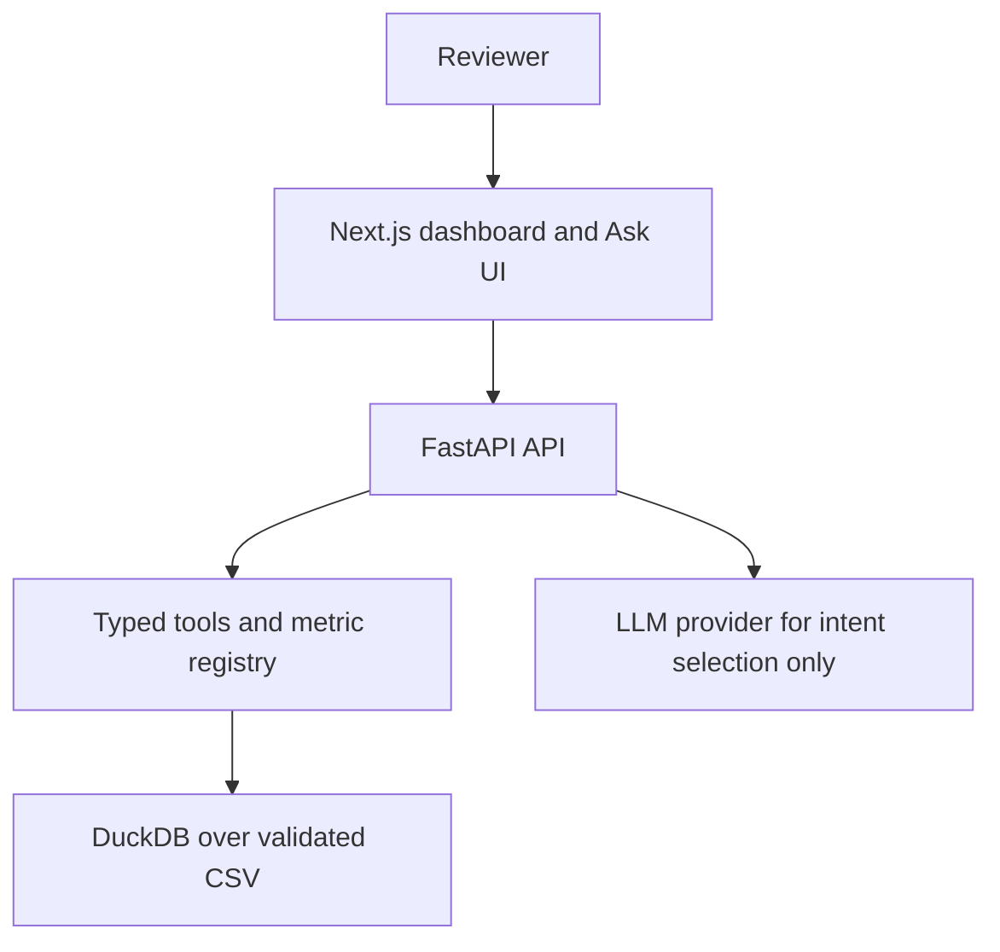

# Spaceship Logistics Analytics — Implementation Plan

Status: execution plan for `itanium-g/logistics-data-analytics`
Companion decision record: `deep-research-report.md`
Last verified: 2026-09-09

This plan converts the research report into a buildable senior take-home submission. The target repository currently contains the report only; the application work starts from this plan.

## 1. Final decision

Build the **medium-scope submission** in approximately **9–12.5 experienced-engineer person-days**.

| Decision | Choice | Why |
|---|---|---|
| Data plane | CSV + DuckDB, with an explicit data contract | The dataset is 400 rows; a managed database adds setup without improving the interview signal. |
| Backend | Python 3.12 + FastAPI + Pydantic | Matches analytics/forecasting work and gives typed API contracts quickly. |
| Semantic layer | Code-level metric registry | One auditable source for formulas, descriptions, units and allowed dimensions. |
| AI boundary | One constrained router with `query_metric` and `forecast` tools | The model maps language to typed intent; deterministic code decides what is true. |
| Frontend | Next.js/React + Recharts | Polished dashboard and inspectable Ask workflow. |
| Forecast | Category × month, `SUM(quantity)`, simple baselines | The source contains only one calendar year; complex seasonal models would overfit. |
| Hosting | Vercel + Railway, with secrets in platform configuration | Fast reviewable deployment and low operational burden. |
| Scope boundary | No raw text-to-SQL, no arbitrary agent tools, no OAuth/RBAC, no SKU-level forecasting | These add risk or effort without solving a demonstrated assignment need. |

The critical correction versus the upstream reference is dimensional consistency: if the UI says “inventory units,” the forecast target must be `quantity`, not order count.

## 2. Requirements and evidence gate

Before implementation, manually open the original assignment and attachments and complete this table in the project README:

| Requirement | Evidence source | Planned feature | Verification |
|---|---|---|---|
| Dataset ingestion/profile | Assignment + supplied CSV | Data contract and startup validation | Contract tests |
| KPI/dashboard | Assignment | KPI tiles and operational charts | Golden-value tests + browser smoke |
| Natural-language analytics | Assignment | Typed router + deterministic tools | Mocked routing eval |
| Forecasting | Assignment | Category demand forecast with limitations | Forecast tests + baseline comparison |
| Explainability | Assignment/bonus | Query plan, formula, filters, method and data table | UI inspection |
| Reliability | Assignment/bonus | CI, errors, health endpoint, bounded inputs | CI + API contract tests |
| AI disclosure | Explicit candidate disclosure | `AI_USAGE.md` with examples and review notes | Reviewer can inspect it |
| Other/bonus | Original brief only | Decide deliberately; do not assume | Checklist signed before submission |

If the original brief conflicts with this plan, the brief wins. Record the change in `deep-research-report.md`.

## 3. Target architecture



Rules:

- The LLM never receives database credentials, SQL execution, shell, filesystem, URL-fetching or write tools.
- Tool arguments are validated again in application code with Pydantic.
- SQL identifiers come only from registry-controlled names; values use parameter binding.
- Tool results remain structured and are rendered deterministically whenever a template is sufficient.
- Any unsupported request is rejected explicitly; it is never silently clipped or decomposed.

## 4. Data and semantic contract

Profile the CSV once and pin the following verified baseline:

| Fact | Expected value |
|---|---:|
| Row count | 400 |
| Date range | 2025-01-01 through 2025-12-30 |
| Delivered | 304 |
| Delayed | 55 |
| In transit | 27 |
| Exception | 11 |
| Canceled | 3 |
| Unique SKUs | 355 |
| Total raw order value | $13,695.87 |
| Revenue exposure proxy | $2,386.10 |
| On-time assumption | 304 / (304 + 55 + 11) = 82.16% |
| Total quantity | 1,310 |

Every metric declaration must include:

- formula;
- numerator and denominator, where applicable;
- source columns and status semantics;
- output unit;
- null/zero-denominator behavior;
- whether it is descriptive truth or an exposure/forecast proxy.

Initial registry:

| Metric | Definition | Unit |
|---|---|---|
| `total_orders` | `COUNT(*)` in scope | count |
| `delivered_orders` | status = `delivered` | count |
| `delayed_orders` | status = `delayed` | count |
| `on_time_rate` | delivered / (delivered + delayed + exception) | percent |
| `delay_rate` | (delayed + exception) / completed outcomes | percent |
| `avg_delivery_days` | mean date difference where delivery date exists | days |
| `total_revenue_usd` | sum of raw `order_value_usd` | USD |
| `in_transit_orders` | status = `in_transit` | count |
| `revenue_at_risk_usd` | raw order value for delayed + exception rows | USD exposure |

Important semantic note: `delivered` is treated as “on time” only because the dataset lacks an expected/SLA delivery date. Label this assumption in the UI and README; do not present it as an objectively derived SLA rate.

## 5. Ordered execution plan

Tasks are intentionally gated. Do not begin the next phase until the prior phase’s exit criteria pass.

| Phase | Work | Estimate | Exit gate |
|---|---|---:|---|
| 0. Brief lock | Read assignment/attachments; create requirement matrix; decide required vs bonus scope | 0.25–0.5 d | No unknown mandatory requirement |
| 1. Data truth | Add CSV loader, schema checks, profiling notes, status/date/value semantics | 0.75–1.0 d | Contract tests pass; golden facts reproduced |
| 2. Semantic/query layer | Implement registry, safe filters, date grains, multi-metric support or explicit exceptions, query-plan output | 1.5–2.0 d | Formula tests and API contract pass |
| 3. Deterministic API | Health, KPI, chart presets, generic typed analytics endpoint, stable error envelope | 0.75–1.0 d | Clean local API smoke run |
| 4. LLM boundary | Dynamic dataset context, narrow schemas, server-side validation, unsupported contract, mocked provider adapter | 1.0–1.5 d | 30–50 routing cases; no arbitrary SQL |
| 5. Forecast | Category-month `SUM(quantity)`, moving-average/linear baseline, nonnegative output, limitations and baseline metric | 0.75–1.0 d | Unit tests + holdout sanity check |
| 6. Frontend | Dashboard, chart/table rendering, Ask form, plan/evidence panel, loading/error/unsupported states, responsive layout | 1.5–2.0 d | Browser smoke and mobile inspection pass |
| 7. Quality/security | CI, lint/type checks, rate/budget guard, input caps, CORS, concurrency test, dependency audit | 1.5–2.0 d | Green PR gate; abuse cases fail safely |
| 8. Release/docs | Deploy, health-check, README, architecture/assumptions, `AI_USAGE.md`, demo script | 0.75–1.0 d | Reviewer can run or open the app and understand limits |

Total: approximately **9.0–12.5 person-days**. If time is cut, remove visual extras and complex forecasting first; preserve data truth, security boundary, tests, deployment health and disclosure.

## 6. High-priority backlog

### P0 — must ship

- [ ] Requirement-to-feature matrix tied to the original brief.
- [ ] CSV schema and value contract.
- [ ] Golden KPI tests, including the 82.16% status-based on-time assumption.
- [ ] Metric registry with formula, unit, denominator and limitations.
- [ ] Parameterized deterministic query engine.
- [ ] Typed `query_metric` and `forecast` tools with `extra="forbid"`.
- [ ] Explicit unsupported response for raw SQL, unknown metrics, SKU forecasts, invalid horizons and multi-step questions.
- [ ] Forecast `SUM(quantity)` semantics and methodology text.
- [ ] Dashboard and Ask page with query plan/result evidence.
- [ ] CI on push and pull request.
- [ ] `AI_USAGE.md` with concrete examples.
- [ ] Deployment health check and secret configuration.

### P1 — high reviewer value

- [ ] Value-level filter validation and closest-value suggestions.
- [ ] Non-empty `IN` validation and bounded filter count/row limit.
- [ ] Deterministic answer templates for simple scalar results.
- [ ] Mocked LLM routing evaluation corpus with exact expected tool/arguments.
- [ ] Rate limiting, provider timeout, token/output cap and monthly spend guard.
- [ ] Forecast naive baseline and a small holdout report.
- [ ] Concurrent-request test plus documentation of serialized shared DuckDB access.
- [ ] Client concentration chart implemented through a tested multi-metric query or explicitly documented exception.

### P2 — only if the brief rewards it

- [ ] Dockerfile.
- [ ] Playwright E2E suite beyond the core smoke path.
- [ ] Structured logs and basic request metrics.
- [ ] Auth/demo key.
- [ ] Confidence intervals or bootstrap uncertainty.
- [ ] Clarification loop or controlled multi-step planner.

Do not start P2 work while any P0 item is incomplete.

## 7. Test and acceptance matrix

| Layer | Minimum acceptance |
|---|---|
| Data contract | Required columns/types, 400 rows, dates, unique order IDs, known statuses, nonnegative quantity/value |
| Registry | Every metric has formula/unit; zero-denominator behavior is tested |
| Query engine | Filters are bound; identifiers are registry-controlled; date boundaries and limits are tested |
| API | Health, KPI, chart, validation, missing-provider and error responses are stable |
| Forecast | 1–6 month horizon, known category, unknown category rejection, nonnegative result, quantity-unit consistency |
| LLM routing | 30–50 mocked cases; exact tool/metric/breakdown/date outcome; adversarial unsupported cases |
| Frontend | Dashboard loads; chart units are correct; Ask loading/error/unsupported/answer states work |
| Security | SQL injection strings remain values; raw SQL cannot execute; rate guard returns 429; output is bounded |
| Release | Clean checkout install/build/test path; deployed health endpoint returns expected row count |

A good CI split is:

```text
pull_request / push
├── backend: install lockfile, lint, type-check, pytest, coverage
├── frontend: npm ci, lint, tsc --noEmit, next build
├── integration: start API and run contract/browser smoke
└── security: dependency audit and secret scan

manual or scheduled
└── live LLM routing evaluation with strict token/spend limits
```

## 8. Cost and deployment assumptions

| Item | Planning assumption |
|---|---:|
| Frontend | Vercel Hobby $0/month or Pro $20/month with included usage credit |
| Backend | Railway Free after trial has a stated $1/month charge; Hobby $5 minimum usage |
| LLM | Sonnet 4.6 at $3/M input, $15/M output, $0.30/M cached input on the checked OpenRouter snapshot |
| Typical shared-demo LLM spend | Approximately $10–$50/month at 1,000–2,500 bounded questions, depending on prompt/output and model |
| Main cost control | Remove unnecessary summary call, cache stable instructions, cap rows/tokens, and enforce a spend limit |

Prices change. Keep provider URLs and a check date in the README; never promise a permanent total.

## 9. Reviewer demo script

1. Open the dashboard and show the 400-row health/data contract context.
2. Explain the KPI denominator: delivered ÷ completed outcomes, not an invented SLA.
3. Open a chart and show that it exposes the metric and unit.
4. Ask “Which carrier has the highest delay rate?” and show the typed plan/result.
5. Ask an unsupported compositional question and show explicit rejection.
6. Ask for a category forecast and show history, method, forecast horizon, quantity unit and limitations.
7. Show the repository’s tests, CI, deployment configuration and `AI_USAGE.md`.
8. State the main limitation plainly: one year of sparse data is suitable for a transparent baseline, not seasonal forecasting.

## 10. Ship / stop rules

Ship when:

- all P0 items pass;
- the requirement matrix has no unexplained mandatory gap;
- every displayed number can be traced to a deterministic query or forecast result;
- the public demo has a bounded LLM endpoint and no secrets in the repository;
- the README explains assumptions, limitations, local setup, deployment and AI use.

Stop adding features when:

- the data contract or KPI semantics are still unsettled;
- the LLM routing evaluation is below the agreed threshold;
- the UI is polished but CI or error handling is incomplete;
- a new feature requires raw SQL, unrestricted agent tools, or an unsupported claim about the data.

This is the recommended build order: **data truth → semantics → deterministic API → LLM boundary → forecast → UI → tests/security/deployment → documentation and demo polish**.
