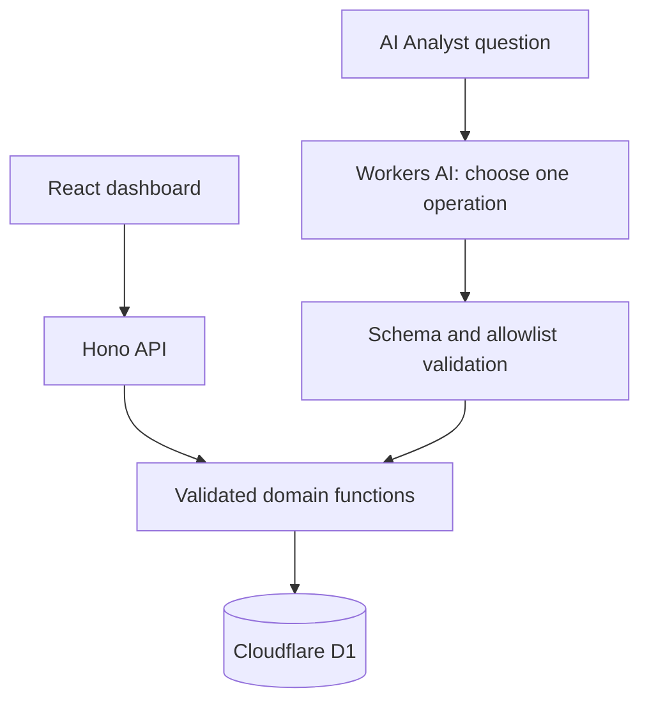

# Spaceship Logistics Analytics

A full-stack logistics dashboard built for the Spaceship Senior Engineer Code Test. It analyzes the supplied synthetic order data, answers bounded natural-language questions, and provides a simple known-SKU demand forecast.

## Review the application

- **Live demo:** [logistics-analytics-demo.ghiffariahmadijaya.workers.dev](https://logistics-analytics-demo.ghiffariahmadijaya.workers.dev)
- **Access:** no login is required; the demo uses synthetic data.
- **Main views:** [Overview](https://logistics-analytics-demo.ghiffariahmadijaya.workers.dev/#overview) and [Forecasts](https://logistics-analytics-demo.ghiffariahmadijaya.workers.dev/#forecasts).

The Overview shows five KPIs, order-volume and status charts, filters, evidence tables, and CSV export. The Forecasts view estimates demand for a known SKU over one to four months. The AI Analyst routes a question to one validated operation; the application computes the returned values.

## Product preview


## Technology

| Layer | Choice |
|---|---|
| Frontend | React, TypeScript, Vite, CSS, Recharts, TanStack Table |
| API/runtime | Hono on Cloudflare Workers |
| Database | Cloudflare D1 / SQLite |
| AI | Native Cloudflare Workers AI binding |
| Quality | Vitest, TypeScript checks, workerd smoke checks, GitHub Actions |

## Architecture

One Worker serves the SPA and API from one origin. Analytical calculations are deterministic and shared by the dashboard, API, forecast form, and AI route.



Important boundaries:

- The model selects `query_metric`, `forecast`, `clarify`, or `unsupported`.
- The model does not receive database rows or supply the numerical answer.
- SQL fields are allowlisted and values are bound.
- Request paths are read-only for order data; only AI quota counters are writable.
- Invalid, ambiguous, unsupported, and provider-failure states fail clearly.

## Run locally

Requirements: Node.js 24+ and the supplied `mock_logistics_data.csv`.

```sh
npm ci
```

Place the supplied CSV at `docs/assignment/mock_logistics_data.csv`. The file is intentionally ignored by Git because it is an assignment input. Then initialize local D1:

```sh
npm run data:import
npm run db:migrate
npm run db:seed
npm run dev
```

Open `http://localhost:5173/#overview`.

The local default keeps the AI route disabled, so the dashboard, query API, and forecast work without a provider call. To use remote Workers AI locally, run `npx wrangler dev --remote` or set `AI_ENABLED="true"` in a local environment file.

## Configuration

Non-secret defaults are in `wrangler.jsonc`. No external API key is required for Workers AI.

| Variable | Purpose |
|---|---|
| `AI_ENABLED` | Enables the natural-language route. |
| `AI_ALLOW_PAID_ESCALATION` | Explicitly permits paid-model escalation; default `false`. |
| `AI_MODEL` | Default Workers AI model; default `@cf/google/gemma-4-26b-a4b-it`. |
| `AI_ESCALATION_MODEL` | Optional paid escalation model. |
| `AI_FALLBACK_MODEL` | Free-compatible fallback model. |
| `AI_GATEWAY_ID` | Optional existing AI Gateway identifier. |
| `AI_MAX_INPUT_TOKENS` | Maximum input bound. |
| `AI_MAX_OUTPUT_TOKENS` | Maximum output bound. |
| `AI_DAILY_ATTEMPT_LIMIT` | Daily AI request limit. |
| `AI_MONTHLY_ATTEMPT_LIMIT` | Monthly AI request limit. |
| `AI_DAILY_TOKEN_RESERVATION_LIMIT` | Daily reserved-token limit. |
| `AI_MIN_INTERVAL_SECONDS` | Minimum interval between AI requests. |
| `AI_TIMEOUT_MS` | AI request timeout. |
| `AI_MAX_RETRIES` | Maximum bounded retries. |

## Data and analytical choices

The supplied fixture contains **400 orders, 17 columns, and 355 SKUs**. The importer validates the schema, dates, amounts, quantities, duplicates, control totals, and the source SHA-256 before generating seed data. See [the data audit](docs/data-audit.md) for the compact control totals.

- `delivered / (delivered + delayed)` is labelled as an **on-time status proxy** because the data has no promised delivery date or SLA threshold.
- Order-cohort questions use `order_date`; delivery-event questions use `delivery_date`.
- Forecasts use non-canceled quantity and a transparent sparse-history average. The displayed inventory number is a demand-coverage target, not a purchase order or safety-stock guarantee.
- The public demo is intentionally read-only and unauthenticated because the dataset is synthetic.

## Verification

Run the complete local checks with:

```sh
npm run typecheck
npm test
npm run build
npm run smoke
npm run verify
```

`npm run smoke` checks the built application with local workerd and does not contact Workers AI. CI runs the typecheck, test, build, and deterministic smoke checks on pushes and pull requests.

The repository also includes a live Workers AI evaluation runner and frozen cases. Provider availability, quota, and model behavior can change, so the stored evaluation output is not presented as a permanent production pass-rate guarantee. The AI route has explicit disabled, rate-limit, timeout, and invalid-response states; deterministic analytics remain available if the provider is unavailable. See [AI validation notes](docs/ai-validation.md).

## Limitations and next steps

- The dataset is synthetic and read-only; there is no upload, edit, delete, authentication, or multi-tenant workflow.
- Exact SLA compliance, delay causes, delay cost, stock on hand, inbound supply, lead time, and backorders cannot be inferred from the supplied fields.
- Forecasts are illustrative baselines without confidence intervals or backtesting.
- Future work could add authenticated real-data access, richer forecast evaluation, query history, and code splitting for the chart bundle.

## Submission documents

| Document | Purpose |
|---|---|
| [Assignment coverage](docs/requirements.md) | Concise requirement-to-feature mapping. |
| [Architecture notes](docs/architecture/implementation-plan.md) | Runtime boundaries and design decisions. |
| [Data audit](docs/data-audit.md) | Dataset facts and metric assumptions. |
| [AI validation notes](docs/ai-validation.md) | AI route design and evidence scope. |
| [Cloudflare deployment](docs/deployment/cloudflare.md) | Short deployment/runbook instructions. |
| [Submission checklist](docs/submission-checklist.md) | Employer handoff information. |
| [Assignment sources](docs/assignment/README.md) | Supplied materials and reference links. |
| [AI usage disclosure](AI_USAGE.md) | Required disclosure of AI assistance. |
