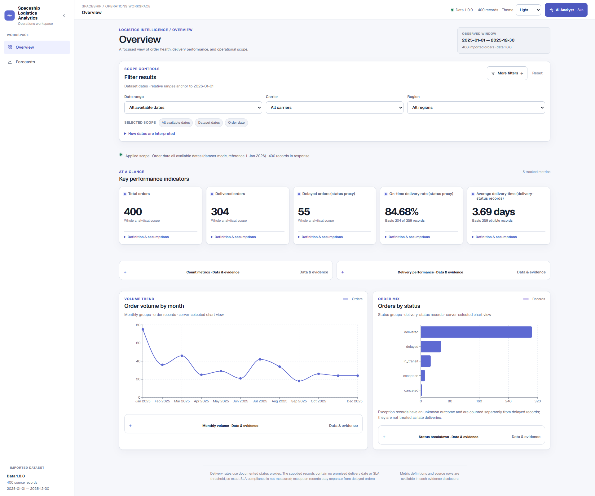
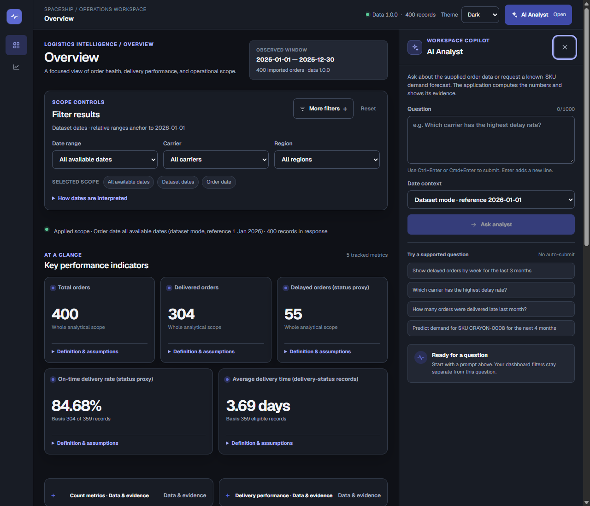
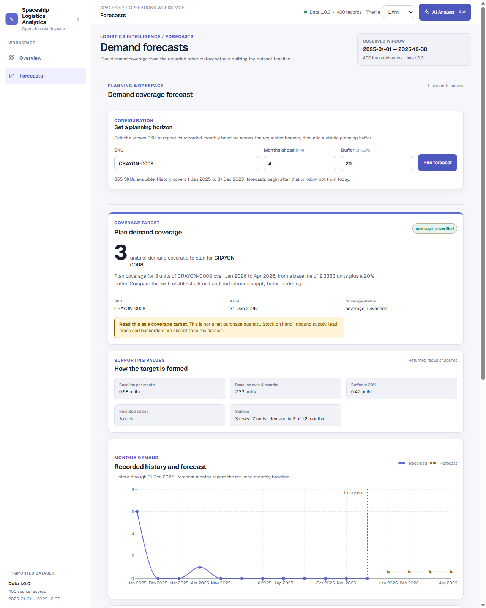
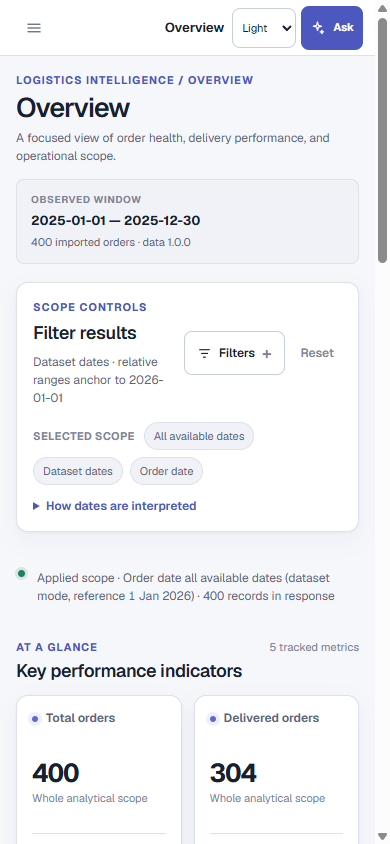
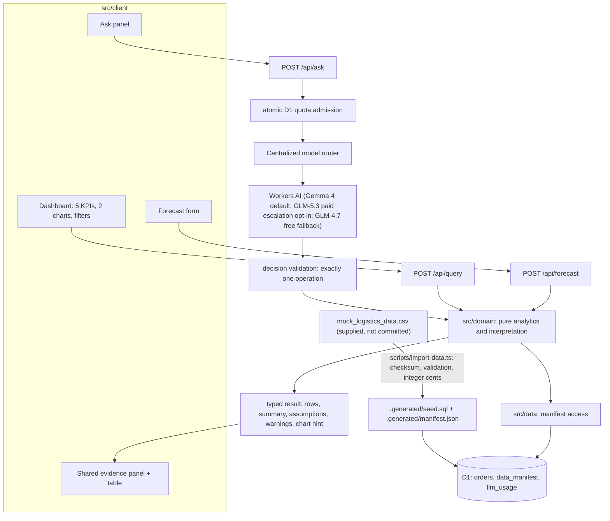

# Spaceship Logistics Analytics

A logistics analytics application over the supplied 400-order synthetic dataset: a React dashboard with five KPIs and two charts, a bounded query API, a known-SKU demand forecast with an inventory coverage target, and a natural-language routing boundary in which a model selects one operation and the application computes every number.

## Live Application

**Cloudflare deployment:** https://logistics-analytics-demo.ghiffariahmadijaya.workers.dev

The public demo runs as Worker `logistics-analytics-demo` with Workers Static Assets, D1 and the native Workers AI binding. It is deployed from the verified `main` branch; no login is required for the synthetic dataset.

## Product Preview

### Operations Overview



### AI-assisted Analytics



### SKU Forecasting



### Mobile Experience



**Status: implemented, merged into `main`, deployed and production-validated.** Deterministic analytics, forecasting, responsive UI and the public API are operational. The production Workers AI route was exercised once but did not return a successful answer: the question `How many orders are there?` returned `422 unsupported`, and an immediate retry correctly returned `429` because of the 60-second pacing guard. The 20-case live evaluation remains unrun; no paid escalation occurred.

| Document | Purpose |
|---|---|
| [Implementation plan](docs/architecture/implementation-plan.md) | Scope, contracts, sequencing and acceptance gates. |
| [Requirements matrix](docs/requirements.md) | Source-by-source requirements and the evidence for each. |
| [Data audit](docs/data-audit.md) | Independently calculated dataset facts and metric definitions. |
| [Assignment materials](docs/assignment/README.md) | Supplied file names and checksums; the originals are not committed. |
| [Cloudflare deployment](docs/deployment/cloudflare.md) | Single-worker production deployment on Cloudflare D1 and Workers AI. |
| [AI_USAGE.md](AI_USAGE.md) | Disclosure of AI assistance. |
| [Submission checklist](docs/submission-checklist.md) | Handoff state. |
| [Architecture research](docs/research/architecture-research.md) | In-depth platform architecture and technology evaluations. |
| [Historical comparison](docs/research/historical-comparison.md) | Retained hosting and provider comparison research. |

## Local setup

Requires Node 24 or newer (verified on **Node v24.21.0**, npm **11.19.0**) and the supplied `mock_logistics_data.csv`.

```sh
npm ci
```

npm 11 blocks package install scripts by default. `esbuild` and `workerd` need theirs, and `package.json` already records that approval in `allowScripts`, so `npm ci` completes without prompting. If you install with an older npm and the Workers runtime is missing, run `npm install-scripts approve esbuild` and `npm install-scripts approve workerd`.

Place the supplied CSV at `docs/assignment/mock_logistics_data.csv` (the default input path; the originals are gitignored and are not repository content), then import, migrate and seed:

```sh
npm run data:import
npm run db:migrate
npm run db:seed
npm run dev
```

Open `http://localhost:5173/#overview`. Switch between Overview and Forecasts using the desktop sidebar or mobile navigation drawer. The header offers System/Light/Dark appearance and the AI Analyst. At 1280px and wider the assistant docks beside the workspace; at narrower widths it opens as a modal. Overview scope, forecast inputs/results and the assistant draft/submitted interaction remain in their mounted controllers when changing workspaces; result-table controls can reset when their table unmounts.

Overview filters apply immediately to all five KPIs and both charts: date range, carrier, region, category, warehouse, status, dataset/current date context and order/delivery date basis. More filters reveals secondary controls; mobile Filters reveals the fields. Removable scope chips and Reset restore the selected scope. The assistant has its own date context; dashboard filters do not scope its question. Suggested questions fill the draft without submitting, and retries use the submitted question and context.

Grouped and temporal query tables and the forecast table support local search, raw-value sorting, facets where available, column visibility and pagination (25 rows by default; 10/25/50/100 options). These controls affect returned rows only, leaving charts and whole-scope evidence unchanged. Scalar query results use a simple table. Export CSV includes all locally filtered/sorted rows before pagination, visible columns with mandatory identifiers and metric basis companions, raw values and JSON `export_context`. It is a returned-data extract, not a complete evidence report. See [table and CSV details](docs/frontend-redesign.md#tables-and-csv).

`npm run data:import` verifies the input SHA-256 against the catalogued value, validates all 17 columns of every row, and refuses to write anything if a field is invalid or if a control total does not reproduce. Use `--input` for a different path and `--allow-checksum-mismatch` only when deliberately importing another dataset:

```sh
npm run data:import -- --input /absolute/path/to/mock_logistics_data.csv
```

Verification commands, all of which pass on a clean install:

```sh
npm run typecheck   # three TypeScript projects: browser, server, component tests
npm test            # comprehensive test suite across domain, server, client, and AI
npm run build       # SPA plus Worker bundle
npm run smoke       # 13 checks against the built app on workerd
npm run verify      # run typecheck, test, and build together
```

`npm run smoke` builds nothing itself: run `npm run build` first. It starts the Cloudflare preview server, which is workerd plus the static-asset layer, so it exercises the same routing model as a deployment.

### Environment variables

Non-secret configuration lives in `wrangler.jsonc` under `vars`. Workers AI uses the native Cloudflare `AI` binding directly without external API keys or secrets.

| Variable | Default | Purpose |
|---|---|---|
| `DB` | local D1 | D1 binding for analytics, the provenance manifest and usage counters. |
| `AI` | Workers AI binding | Native Cloudflare Workers AI binding. |
| `AI_ENABLED` | `"false"` | Enables `/api/ask`. Only the exact strings `"true"` and `"false"` are accepted. |
| `AI_ALLOW_PAID_ESCALATION` | `"false"` | Explicit opt-in for paid-model escalation; long prompts, complex questions and retries stay on the free-compatible default when false. |
| `AI_MODEL` | `"@cf/google/gemma-4-26b-a4b-it"` | Cloudflare Workers AI default model identifier (Gemma 4). |
| `AI_ESCALATION_MODEL` | `"@cf/zai-org/glm-5.3-flash"` | Paid escalation model, used only when `AI_ALLOW_PAID_ESCALATION` is true. |
| `AI_FALLBACK_MODEL` | `"@cf/zai-org/glm-4.7-flash"` | Free-compatible fallback if explicitly enabled paid escalation cannot be billed. |
| `AI_GATEWAY_ID` | unset | Optional existing AI Gateway id; no Gateway is provisioned or used by default. |
| `AI_MAX_INPUT_TOKENS` | `4096` | Complete input bound, including schema and prompt. |
| `AI_MAX_OUTPUT_TOKENS` | `512` | Output cap, including structured output tokens. |
| `AI_DAILY_ATTEMPT_LIMIT` / `AI_MONTHLY_ATTEMPT_LIMIT` | `100` / `1000` | Durable request ceilings. |
| `AI_DAILY_TOKEN_RESERVATION_LIMIT` | `180000` | Daily token reservation. |
| `AI_MIN_INTERVAL_SECONDS` | `60` | Global pacing between generations. |
| `AI_TIMEOUT_MS` | `15000` | Workers AI call timeout. |
| `AI_MAX_RETRIES` | `2` | Maximum retries with exponential backoff on transient errors. |

With the defaults, `/api/ask` returns a `provider_disabled` state that explains itself, and the dashboard, query API and forecast all keep working. To try routing locally with remote Workers AI, run `npx wrangler dev --remote` or set `AI_ENABLED="true"`.

## Architecture and data flow

One Worker serves the SPA and the API on a single origin. `wrangler.jsonc` sends `/api` and `/api/*` to the Worker first — including browser navigations — so a mistyped API path returns JSON 404 rather than the SPA shell with a 200.

### Technology stack

| Layer | Technology | Role |
|---|---|---|
| Frontend | React 19.3, TypeScript 7, Vite 8.3, ordinary CSS, Geist | Responsive Overview and Forecasts workspaces, themes and accessible UI. |
| API/runtime | Cloudflare Workers, Hono 4.13 | Single-origin HTTP API and SPA serving. |
| Data | Cloudflare D1 / SQLite | Orders, provenance manifest and durable AI quota state. |
| Analytics | TypeScript domain modules, Zod 4.6 | Validated contracts, deterministic metrics, bounded query compilation and SKU forecasting. |
| Visualization and tables | Recharts 3.10, TanStack Table 8.21 | Charts, evidence tables, local filtering, sorting, pagination and CSV export. |
| Natural-language routing | Native Cloudflare Workers AI binding | Bounded structured interpretation only; application code computes every analytical result. |
| Verification and delivery | Vitest 4.1, workerd smoke checks, GitHub Actions, Wrangler 4.131 | Automated tests, runtime checks, CI and Cloudflare deployment. |



| Path | Responsibility |
|---|---|
| `src/shared/` | Contract enums and response types, dataset constants, error taxonomy and the runtime-neutral `SqlDb` port. No request validator is imported into the browser entrypoints. |
| `src/domain/` | Pure metric registry, date interpretation, bounded query compiler, forecast, chart selection, value formatting, decision validation, prompt construction and answer rendering. |
| `src/data/` | Persisted manifest reads plus CSV validation and deterministic seed SQL generation. |
| `src/server/` | Hono routes, the D1 adapter in `db/d1.ts`, request guards, quota guard and Workers AI client in `ai/client.ts`. |
| `src/client/` | Modular client application: app shell, features (overview, forecast, assistant, table, evidence), UI components, styles and API client. |
| `scripts/` | Offline importer, local smoke harness, and live AI evaluation runner. |
| `migrations/`, `.generated/manifest.json` | Schema and import provenance. |
| `tests/`, `evals/` | Automated checks (unit, component, server, AI) and the frozen live-acceptance cases. |

The boundary is intentional: domain code depends on the runtime-neutral SQL port and typed manifest model, never on Cloudflare's environment binding. D1-specific adaptation stays in `src/server/db/d1.ts`; importer and persisted-manifest concerns stay in `src/data/`.

Design decisions worth naming:

- **The dashboard and the natural-language path call the same domain functions.** Neither has its own SQL or its own arithmetic, so they cannot report different numbers for the same question.
- **All SQL identifiers come from constant maps and every value is bound.** The request shape has no field capable of holding an expression, a join or a second statement, so injection is rejected at the schema before any compilation.
- **Aggregation happens in SQL; ranking and truncation happen in TypeScript.** Group counts here are at most a few hundred, and doing it this way makes `total_groups` exact, keeps ties stable and puts undefined rates last without depending on engine-specific NULL ordering.
- **Money is integer cents, parsed from the source string.** `11.69 * 100` is `1168.9999999999998` in IEEE-754; the importer never multiplies.
- **`delivery_days` is derived once at import.** Average delivery time is then a plain average with no engine-specific date arithmetic.
- **Ratios always carry their numerator and denominator; averages carry their eligible count.** A rate with no denominator returns null with an explanation, never `0.00%`.
- **Usage counters live in their own table and code path.** Re-importing data replaces order rows and the manifest but never touches consumed quota, and the generated seed never names the usage table.

## Question interpretation and tool selection

`POST /api/ask` gives the model the question, the operation contract, the date context and the small filter vocabularies. It does not receive source rows, computed results, database access or the full 355-item SKU list — SKU-shaped tokens are extracted from the question and checked against the imported data instead.

The model returns one JSON object under a strict schema and may select exactly one of four operations:

| Operation | When | What runs |
|---|---|---|
| `query_metric` | Counts, rates, averages, trends, rankings | The same bounded query compiler the dashboard uses. |
| `forecast` | Future demand for one named SKU | The same forecast function the forecast form uses. |
| `clarify` | A required detail is genuinely missing | Nothing. The missing field is named and no value is assumed. |
| `unsupported` | The data cannot answer the question | Nothing. The reason and the closest supported question are returned. |

Strict structured output requires every property to be present, so the wire schema carries all four branches with unused ones null. Validation then rejects a missing branch, a second populated branch, an unknown tool, extra keys, prose, code fences and truncated output. A decision that parses but selects the wrong plan is treated as a routing failure, not an answer. Arguments are then validated by the same schema the direct API uses, so a plan that would produce an invalid query is refused rather than approximated.

Every number in the answer text is read from a computed result field and formatted by the same functions the dashboard uses. The plan panel shows the validated interpretation; it does not show model reasoning.

Worked examples, all verified against the deterministic API:

| Question | Interpretation | Result |
|---|---|---|
| Show delayed orders by week for the last 3 months | `delayed_orders`, week grain, order date, 2025-10-01 to 2025-12-31 | Weekly line chart; the buckets sum to 10. A boundary week starts before 1 October, and the requested bounds are still reported unchanged. |
| Which carrier has the highest delay rate? | `delay_rate` by carrier, ranked descending over the full scope | GLS at 28.57%, shown as 2 of 7 records, with 9 carrier groups ranked. |
| How many orders were delivered late last month? | `total_orders`, **delivery date** basis, December 2025, status `delayed` | 4. Filtering order date instead would answer 3, which is a different question. |
| Predict demand for SKU CRAYON-0008 for the next 4 months | forecast, horizon 4, buffer 20% | 7/12 units per month for January to April 2026 and a coverage target of 3 units. |
| How much inventory should I plan? | clarify, missing `sku` | A question back. No SKU is guessed and no number appears. |
| What is the exact on-time SLA rate? | unsupported | Explains that no promised dates or SLA thresholds exist, and offers the labelled status proxy. |

## Metrics

Metric version 2. The brief names the KPIs without prescribing formulas, so these definitions are explicit project choices.

| Metric | Definition within the selected scope | Value over the whole dataset |
|---|---|---|
| Total orders | Count of orders; `order_id` uniqueness is enforced at import | 400 |
| Delivered orders | `status = delivered` | 304 |
| Delayed orders (status proxy) | `status = delayed`; exceptions counted separately | 55 |
| On-time delivery rate (status proxy) | delivered / (delivered + delayed) | 304/359 = 84.68% |
| Average delivery time (delivery-status records) | Mean whole calendar days for dated delivered or delayed records | 1324/359 = 3.69 days |

Supporting metrics: delay rate (55/359 = 15.32%), exception, in-transit and canceled counts, total and non-canceled units, raw order value, and order value on delayed or exception records.

## Assumptions and simplifications

- `delivered` is the on-time proxy and `delayed` is the late proxy. The dataset has no promised delivery date and no SLA threshold, so **exact SLA compliance cannot be measured**. `exception` records have an unknown outcome and are excluded from rate denominators; a delivery date on an exception row does not establish delivery.
- January to December 2025 is assumed to be a complete synthetic observation window. The last order is dated 2025-12-30, which proves neither completeness nor incompleteness, so observed bounds and assumed coverage are recorded separately and every forecast reports `coverage_unverified`.
- Dataset mode is the default and anchors relative expressions to 2026-01-01, the day after assumed coverage ends, so "last month" means December 2025. Current mode uses today's UTC date and can legitimately return nothing; ranges are never silently shifted into 2025.
- Order cohort questions use `order_date`; delivery-event questions use `delivery_date`. A delivery-date scope necessarily excludes in-transit and canceled orders, which have no delivery date.
- Order identifiers contain `2026` while all dates are 2025. Identifiers are opaque and are never parsed for dates.
- Order value is the raw supplied amount. It is not net revenue, and promotion discounts are not subtracted. Value on delayed or exception records is associated exposure, not measured loss.
- The forecast baseline repeats a single monthly average with no seasonality, trend or promotion effect. Every SKU in this dataset is sparse — 313 of 355 appear once — so the twelve-month mean branch applies throughout; a trailing three-month mean is used only when at least six months recorded demand.
- The inventory output is a demand-coverage target: the horizon baseline plus a visible buffer, rounded up once after summing. It is **not** a net purchase quantity, a reorder point, a calibrated safety stock or a service-level guarantee, because stock on hand, inbound supply, lead times and backorders are absent from the dataset.
- No accuracy, confidence interval or backtest is claimed. Twelve sparse observations cannot establish forecast quality.
- The public demo has no authentication, which is appropriate for supplied synthetic data and is not a pattern for real customer data. The origin check on POST requests is hardening, not authentication.

## Unsupported queries

These fail honestly rather than approximating:

- Exact SLA compliance, promised delivery dates, causes of delay, cost of delay, customer identities: no such data exists.
- Arbitrary SQL. The contract has no field that can carry an expression; a `raw_sql` key is rejected before anything executes.
- A time series and a dimension breakdown in one result, and ranking a time series. The caller is asked to choose a trend or a ranking.
- Category-level forecasts, horizons beyond four months, custom forecast start dates and alternative forecast methods.
- More than three metrics, more than five filters, more than 20 values per filter, or a limit above 100.
- Uploads, edits and deletes. Request paths expose no write to the analytics tables.
- Multi-step agent actions, and any answer whose numbers would come from the model rather than from a computation.

## Verification performed

The original implementation checks below were run on this machine after a clean `npm ci`. The documentation refresh reran typecheck, all 253 tests in 23 files, the production build and 13/13 workerd smoke checks against the current working tree. After the edits, all nine documentation tests, local Markdown links/anchors, screenshot references and `git diff --check` passed. The refresh did not reinstall dependencies or reimport the data. External URL syntax was checked; historical vendor destinations and terms were not revalidated.

- **Import:** every control total in [docs/data-audit.md](docs/data-audit.md) reproduced independently — 400 rows and 400 unique ids, order dates 2025-01-01 to 2025-12-30, latest delivery date 2025-12-31, 304/55/11/27/3 by status, 370 dated and 30 missing delivery dates, 1310 total and 1303 non-canceled units, USD 13,695.87 raw value, USD 2,386.10 on delayed or exception records, 355 SKUs, 8 categories, 9 carriers, 30 clients, 5 regions, 9 warehouses, 22 promotion rows, zero value mismatches, the twelve monthly controls, and the 313/39/3 SKU frequency profile. The importer refuses to emit output if any control disagrees.
- **253 automated tests in 23 files.** Domain and route tests execute real SQL against Node's built-in `node:sqlite` through the same interface D1 satisfies, so the statements under test are the ones the Worker runs. Component tests render the real components against real API responses. A jsdom test mounts the whole application and serves its fetch calls from the real Worker over the seeded dataset. Documentation tests check script names, environment variables and exact dependency pins; shell, table and CSV tests cover the frontend additions.
- **Analytics:** the five KPIs to full precision, null-denominator cases, the delivered-only mean of 3.25 days kept as a separately labelled fact, a proof that a mean of per-carrier rates is not the aggregate ratio, all three brief examples, chart and table parity, truncation after full-scope ranking, and undefined rates ordered last.
- **Query safety:** injected SQL in filter values and in metric, dimension and grain positions is rejected with the dataset intact; oversized, empty and non-JSON bodies, cross-origin POSTs, inverted and impossible date ranges, and conflicting date inputs are all refused.
- **Forecast:** the CRAYON-0008 example exactly — monthly series `[6,0,0,1,0,0,0,0,0,0,0,0]`, sparse method, 7/12 units for each of January to April 2026, a 7/3 base and a coverage target of exactly 3 units, as of 2025-12-31. Rounding once is proved distinct from rounding per month; unknown SKUs, canceled-only SKUs, and horizon and buffer bounds are all covered.
- **Routing boundary:** tests stub the HTTP transport, not the adapter, so the real provider code runs — request body, status handling, usage, finish reason and error mapping — with no network. Proven: all four operations route correctly; prose, an unknown tool, a `raw_sql` key, an injected metric name and two populated branches all execute nothing; timeout, 429 with `Retry-After`, 500 and truncation map to distinct codes; a timeout makes exactly one call.
- **Quota:** five concurrent requests competing for a single remaining slot admit exactly one and refuse four; daily attempt, monthly attempt and token limits bind; a reservation is retained after a provider failure; a UTC day rollover starts a fresh allowance; a disabled provider consumes nothing.
- **Runtime:** 13 smoke checks against the built app on workerd, covering the API and SPA routing split, the metric contract from local D1, both query examples, the forecast target, the disabled-provider state and SPA deep links. This checks HTTP/runtime and static-serving behavior; it does not assert rendered chart SVG geometry.
- **Secrets:** the built client bundle contains no key value, no provider endpoint and no `Authorization` header. No provider API keys are present in source or built assets; Workers AI uses the native binding and production enablement is configuration-only.

Two things the automated checks do not cover, and where they are covered instead: Recharts measures its container, which jsdom reports as zero-sized, so chart SVG dimensions and stable geometry are checked during the Chrome DevTools browser review rather than in jsdom; and the model's actual routing quality is not measured at all, because no live provider call has been made.

## Browser verification

The current 12 checked-in captures were refreshed from the local application in Chrome DevTools 153.0 at device scale 1. They cover light/dark Overview, docked/modal assistant, mobile navigation and filters, direct forecast results, GLS scope and searched/sorted evidence. Fonts were loaded and chart frames stable before capture; each image was visually inspected. Exact viewports, analytical values and review limits are in the [screenshot README](docs/screenshots/README.md). Production was separately reviewed at 390, 768, 1280, 1440 and 1920px widths, including the docked forecast breakpoint, mobile assistant modal, dark theme, filters and direct navigation; no page-level horizontal overflow or console errors were observed. The checked-in PNGs remain local captures because the browser tool's file-save whitelist rejected repository paths.

## What is not done

- **The full live model evaluation is outstanding.** [evals/cases.json](evals/cases.json) freezes 20 cases — 12 supported, 4 ambiguous, 4 adversarial — with expected plans and facts defined before any run. The minimal production probe returned `422 unsupported`, followed by the expected pacing `429`; this is not enough evidence to claim live routing accuracy.
- **Checked-in production screenshots remain outstanding.** Production UI states were visually reviewed, but the Chrome DevTools screenshot writer rejected repository paths, so the stable PNG catalog remains the verified local capture set.
- **External submission remains outside the repository workflow.** Reviewer communication or an employer submission form must be completed by the owner.

## Known characteristics

The client bundle is 729.98 kB (210.60 kB gzipped), mostly Recharts and TanStack Table, which trips Vite's large-chunk warning. The recorded baseline was 650.27 kB (190.07 kB gzipped), so the redesign delta is approximately +79.71 kB raw / +20.53 kB gzip. This remains below the 40 KiB gzip investigation threshold; the warning is not silenced and code splitting remains outside this scope.

Resolved dependency versions, pinned exactly: React 19.3.0, Vite 8.3.0, TypeScript 7.0.2, Hono 4.13.7, Zod 4.6.4, Recharts 3.10.1, Wrangler 4.131.1, Vitest 4.1.11, csv-parse 7.0.2, jsdom 30.0.1. Two deviations from the plan's targets: Vite resolved to 8.3.0 rather than 8.1, and Vitest is pinned to 4.1.11 because `@cloudflare/vitest-pool-workers` still requires the 4.x line. That pool is not installed — tests run in plain Node against `node:sqlite` instead, which keeps the SQL real without a second runtime in the test loop.

## Future improvements

Category-level forecasts, query history, complete evidence-report export, code splitting for the chart bundle, time-ordered forecast evaluation with a naive baseline comparison, a second provider comparison, an automated browser suite, and access controls if the dataset ever stops being synthetic. Returned-row CSV export is implemented. Production identity, calibrated inventory policies and larger datasets are separate scope.

Implementation details, preservation boundaries, table/CSV semantics, dependency rationale and verification limits are recorded in [docs/frontend-redesign.md](docs/frontend-redesign.md).

## Submission state

| Deliverable | State |
|---|---|
| Repository | [itanium-g/logistics-data-analytics](https://github.com/itanium-g/logistics-data-analytics), public. |
| Deployed URL | https://logistics-analytics-demo.ghiffariahmadijaya.workers.dev |
| Deployed revision | Worker version `d9c378be-20bb-42a5-9150-1d83741bd571` (deployment `3fb3a00f-6554-4ce4-9457-90111ac7da7d`), from `main` commit `16635341a6401d91670882d8d200fbeb5bb7b0bf`. |
| Credentials | Not required; no authentication in this profile. |
| Data version | 1.0.0, metric version 2, source SHA-256 `b60f84b1…94bc82`; production D1 verified at 400 rows / 355 SKUs. |

AI assistance is disclosed in [AI_USAGE.md](AI_USAGE.md). Complete [docs/submission-checklist.md](docs/submission-checklist.md) before submitting.
