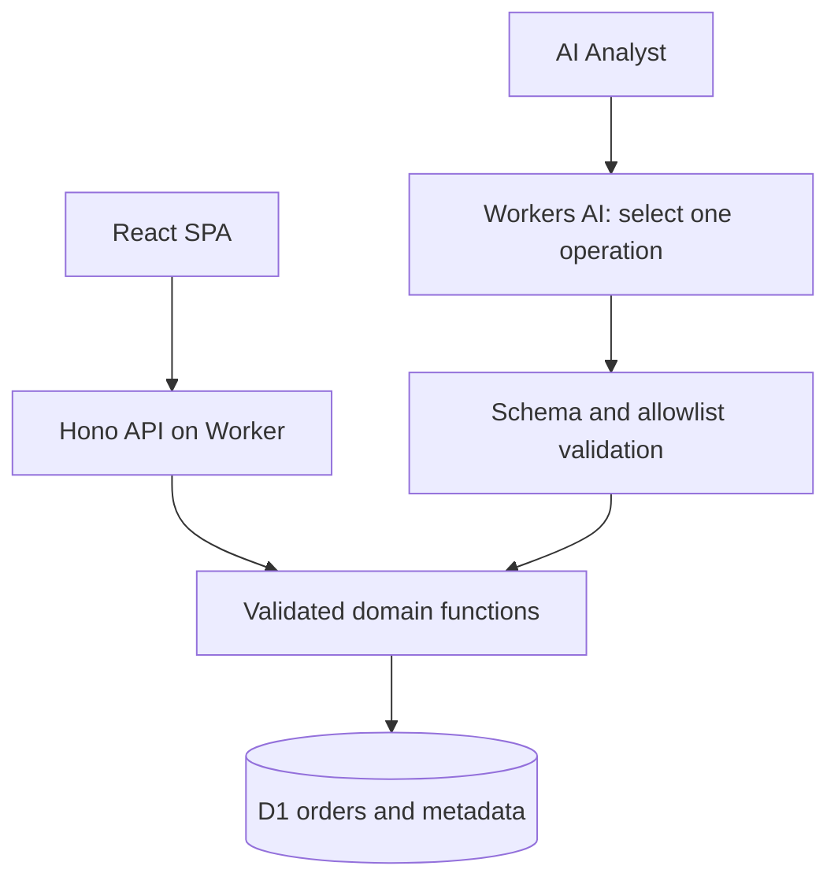

# Architecture and design decisions

This document describes the implemented design of the Spaceship logistics analytics application. It is intentionally short; the [README](../../README.md) is the main reviewer entry point.

## System shape

The application uses one React SPA, one Hono API, one Cloudflare Worker, and one D1 database. The model is used only to select a validated analytical operation.

## Technology choices

| Concern | Choice | Why |
|---|---|---|
| UI | React, TypeScript, Vite, CSS | Small responsive SPA with no unnecessary framework layer. |
| API | Hono on Cloudflare Workers | One public origin for static assets and API routes. |
| Storage | Cloudflare D1 / SQLite | Fits the supplied read-only dataset and keeps deployment simple. |
| Analytics | TypeScript domain modules | Makes metric and forecast behavior deterministic and testable. |
| AI routing | Native Workers AI binding | Avoids a separate provider key and keeps the model outside the data/calculation boundary. |
| Verification | Vitest, TypeScript, workerd smoke checks, GitHub Actions | Covers logic, contracts, UI behavior, and runtime routing. |

## Code boundaries

- `src/client/` contains the dashboard, forecast view, assistant, evidence tables, responsive layout, and API client.
- `src/domain/` contains metric definitions, date interpretation, query validation/compilation, chart selection, forecasting, and AI decision validation.
- `src/data/` validates the supplied CSV and generates deterministic D1 seed data.
- `src/server/` contains Hono routes, D1 adaptation, request guards, quota controls, and the Workers AI client.
- `src/shared/` contains contracts, dataset constants, errors, and the runtime-neutral database interface.

## Request flow

### Dashboard and forecast

1. The browser sends a typed request to `/api/query` or `/api/forecast`.
2. The server validates the request against allowlisted fields, metrics, filters, and bounds.
3. Domain code runs the deterministic query or forecast against D1.
4. The response includes values, scope, assumptions, warnings, and evidence rows.

### AI Analyst

1. The browser sends a question and optional date context to `/api/ask`.
2. Workers AI selects exactly one of `query_metric`, `forecast`, `clarify`, or `unsupported`.
3. The response is checked for valid structure, one operation, and valid canonical arguments.
4. The selected domain function computes the result; the model never supplies the analytical number.

Malformed output, unsupported questions, quota failures, timeouts, and provider failures return explicit error states. No raw SQL, arbitrary tool, second summarization call, or model-generated numeric answer is executed.

## Data and forecast decisions

- Order data is imported once from the supplied CSV and is read-only through the application API.
- `delivered / (delivered + delayed)` is labelled an on-time **status proxy** because promised dates and SLA thresholds are absent.
- Order questions use `order_date`; delivery-event questions use `delivery_date`.
- Forecasts use non-canceled quantity for a known SKU, a sparse-history average, a one-to-four-month horizon, and a visible buffer.
- The forecast coverage figure is a demand-planning target, not a reorder point, purchase order, confidence interval, or service-level guarantee.

## Operational safeguards

- `AI_ENABLED` is false by default locally; paid escalation is false by default everywhere.
- Input/output limits, timeouts, retries, and daily/monthly quota reservations are configured through environment variables.
- The client bundle contains no provider secret.
- The public demo uses synthetic data and no authentication. Real customer data would require access control and a different deployment profile.

## Deliberate non-goals

Uploads, edits, deletes, category-level forecasts, multi-agent workflows, RAG/vector search, query history, and multi-tenant identity are outside the assignment's core scope. They are possible future extensions, not hidden dependencies of the current application.
