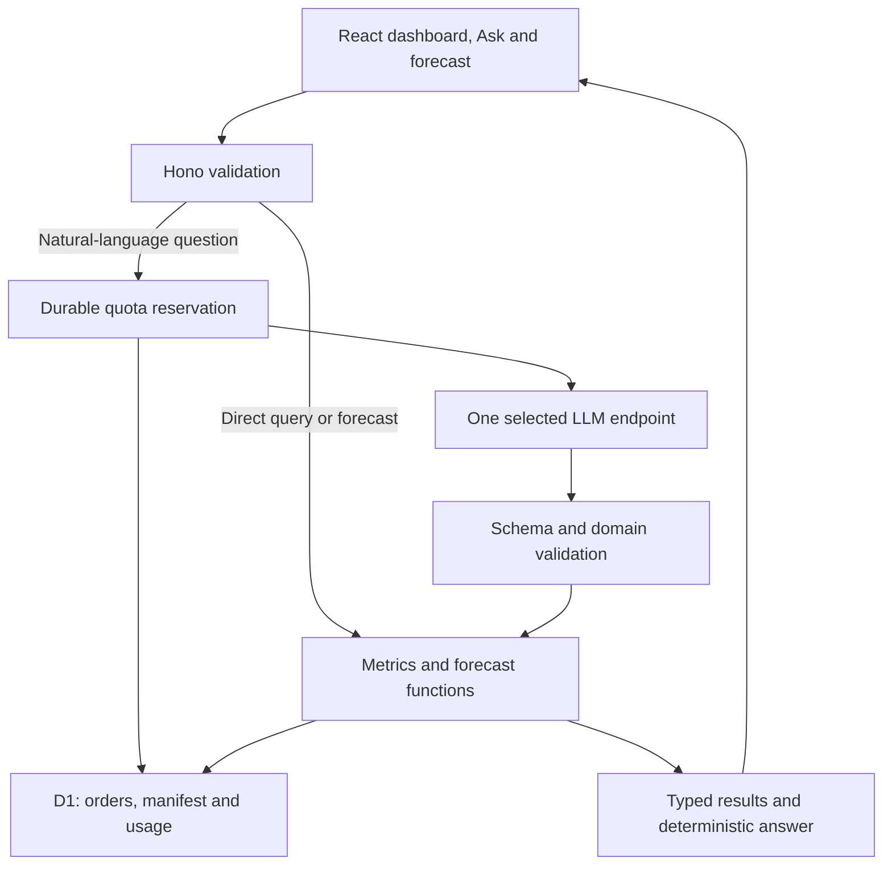

# Complete Setup and Hosting / LLM Comparison

Updated: **2026-09-11 UTC**. Project: [itanium-g/logistics-data-analytics](https://github.com/itanium-g/logistics-data-analytics).

**Historical recommendation only:** the final application uses React + Hono on Cloudflare Workers with Static Assets, D1, and the native Workers AI binding. The earlier Groq and DeepInfra alternatives below were rejected for the final implementation and must not be added as external provider dependencies. Keep dashboard queries, forecasts, arithmetic, and answer rendering deterministic.

This retains the earlier setup design, provider matrices, price assumptions and selection policy. [The implementation plan](../architecture/implementation-plan.md) owns current contracts and release gates. **The application is now implemented and locally verified.** Use [README local setup](../../README.md#local-setup), [package.json](../../package.json) and [wrangler.jsonc](../../wrangler.jsonc) for the current checkout. The scaffold recipes and comparisons below are historical design material, not instructions to recreate or overwrite the existing app. Current Cloudflare model eligibility and the production procedure are documented in [the deployment guide](../deployment/cloudflare.md).

**Assignment reconciliation:** the [supplied originals](docs/assignment/README.md) and [requirements matrix](docs/requirements.md) now govern scope. P0 is a public synthetic-data demo with no login, one free model adapter, known-SKU forecasts for 1–4 months and a 20-case live acceptance set. The former custom sessions, paid ledger, second adapter and 180-call experiment are optional P2 work. The plan's metric v2 and explicit order-date/delivery-date rules apply to every profile.

Prices are USD unless stated otherwise. The broader survey was checked September 10; the recommended stack, primary model shortlist, and selected provider details were refreshed September 11. This covers major relevant options, not every regional reseller or every model SKU. Account dashboards control actual eligibility and limits. Taxes, domains, payment fees, email/SMS, additional account usage, and engineering time are excluded unless a row says otherwise.

## 1. Decision matrix

The supplied brief permits any stack and the authorized sample has been inspected. G00 source review is complete; check the chosen provider account and model data terms before activation. No routing accuracy or latency result has been measured for this project.

| Objective | Complete setup | Estimated monthly recurring cost at the comparison workload | Decision / condition |
|---|---|---:|---|
| Lowest cash cost for the reviewer demo | Workers Static Assets + Hono + D1 + Groq GPT-OSS 20B Free | **$0** within every quota | First candidate. Free model requests can throttle; require passing routing evaluation. |
| Small paid bill with the same model integration | Same hosting + Groq GPT-OSS 20B paid | **$0.1725** token usage; **$5.1725** if Workers Paid is needed | Prefer operational continuity if Groq already passes and its free quota becomes restrictive. |
| Cheapest paid token baseline found in this shortlist | Same hosting + DeepInfra Llama 3.1 8B Instruct Turbo | **$0.0380** token usage; **$5.0380** with Workers Paid | Older model; useful price baseline. Quality and exact schema support need evaluation. |
| Low-price, newer paid model candidate | Same hosting + DeepInfra Gemma 4 E4B | **$0.0500** token usage; **$5.0500** with Workers Paid | Optional P2 challenger. Verify endpoint/schema behavior and passing results. |
| One hosting/inference vendor | Workers + D1 + Workers AI Qwen3 30B A3B FP8 | **$0** within free quotas | Fewer accounts; model-specific JSON support and daily neuron consumption need checking. Paid overflow requires the $5 Workers base. |
| Python or Docker required | One FastAPI container serving the built SPA + read-only DuckDB snapshot + durable Postgres usage state on Northflank Sandbox + selected LLM | **$0** hosting sandbox + selected model | First free container candidate. Check sandbox resources and fit; never store spend counters only on ephemeral disk. |
| Usage-based container deployment | Static frontend + Cloud Run API + durable database + selected LLM | Potentially **$0** inside all allowances; otherwise usage-based | Suitable for Python/Go/Java when container support matters. Builds, database, storage and network charges are separate. |
| Persistent process and full server control | Small VPS + Docker Compose + app + Postgres + selected LLM | Server from **$4–$7/month**, plus backups and usage | Use for an actual server requirement and budget maintenance time. Cheapest server size is not a sizing guarantee. |

These totals assume 1,000 questions/month at 1,500 input and **200 total billable output tokens** each. A reasoning model may exceed that output assumption. The table shows consumption, not necessarily the cash required to open or top up an account. No paid plan change or deployment is performed by this documentation revision.

Selection order: mandatory requirements and permitted data treatment → correct routing → measured runtime/latency → sustainable operating cost → integration effort. Do not assign unsupported numerical quality scores to untested models.

## 2. System design and current stack



One Worker deployment serves the SPA and API on one origin. Only the question, compact contract, permitted vocabulary, and date context go to the model. SQL comes from trusted application templates with bound values. The model never receives database credentials or permission to execute code, SQL, tools, or arbitrary URLs.

| Layer | Selected technology | Why / version policy |
|---|---|---|
| Build runtime | Node **24 LTS** | Pin a supported patch locally and in CI. Node 26 is the Current line at this snapshot; production API execution uses Workers, not a Node server. [Releases](https://nodejs.org/en/about/previous-releases) |
| Language | TypeScript **7.x**, strict checking | Share contracts across browser/server; validate compiler integrations before committing the lockfile. A temporary 6.x pin needs a concrete compatibility reason. [Release](https://devblogs.microsoft.com/typescript/announcing-typescript-7-0/) |
| Frontend | React **19.3.x**, Vite **8.1.x**, Recharts, ordinary CSS | React 19.3 was released September 9 and supersedes the earlier 19.2 setup. Use compatible stable dependencies; experimental Vite modes are unnecessary. [React](https://react.dev/versions), [Vite](https://vite.dev/blog/announcing-vite8-1) |
| API | Current stable Hono + Workers + Cloudflare Vite plugin | Web API runtime, same-origin deployment, local binding emulation. [Hono](https://hono.dev/docs/getting-started/cloudflare-workers), [Cloudflare React guide](https://developers.cloudflare.com/workers/framework-guides/web-apps/react/) |
| Validation | Zod **4**, strict objects, provider schema adapter | One canonical domain contract; accommodate the provider's supported JSON Schema subset without weakening application validation. [Zod](https://zod.dev/v4) |
| Database | D1 / SQLite, SQL migrations, prepared statements | Tiny relational dataset plus durable counters; no ORM or separate cache service initially. [D1](https://developers.cloudflare.com/d1/get-started/) |
| Model transport | Direct server-side `fetch`; one active provider | Start with Groq only; a DeepInfra evaluation adapter is optional P2. No SDK with hidden retries, agent framework, or gateway is required. |
| Tests | Vitest **4.1+**, `@cloudflare/vitest-plugin`; optional Playwright | Focused domain/Worker checks for P0; browser automation is optional. Use the current plugin rather than copying the older pool integration. [Test setup](https://developers.cloudflare.com/workers/testing/vitest-integration/write-your-first-test/) |
| Source / CI / deploy | GitHub, one npm lockfile, pinned Wrangler; optional Actions | Reproducible local checks and one deployment path; CI automation follows when the core is verified. |
| Access / logs | Public synthetic demo, structured provider logs | No login in P0; optional gate requires working reviewer credentials. Record IDs, outcomes, timing and usage, not secrets, raw questions or source rows. |

Keep one package initially. Do not add Next.js/SSR, Redis, queues, vector search, RAG, agents, Kubernetes, or paid monitoring without a requirement that justifies the cost and maintenance.

## 3. Complete application setup

### 3.1 Confirm prerequisites and preserve existing work

Read the [supplied assignment files](docs/assignment/README.md) and [requirements matrix](docs/requirements.md). The user-supplied originals resolve the previous Notion-access gap. Any stack is allowed; the reference answer remains audit context, not the authority. Source review and the local application implementation are complete; use the commands in [README.md](README.md#local-setup) for the current checkout. Deployment and live model evaluation remain outstanding.

Install Node 24 LTS and Git. Inspect the latest repository and any unpushed work before scaffolding. No account or model key is needed for the offline build. A live deployment later needs a Cloudflare account; live model evaluation needs a provider account with permitted inputs and confirmed quota.

Create the scaffold in a **new sibling directory**, then review and integrate its application files into this repository while preserving the documents:

```sh
npm create cloudflare@latest -- logistics-app-scaffold --framework=react
cd logistics-app-scaffold
npm install hono zod recharts
npm install -D vitest@^4.1.0 @cloudflare/vitest-plugin
```

Choose TypeScript and decline immediate deployment in the scaffolder. Resolve the stable lines in the stack table, inspect the resulting scripts/dependency graph, and commit exact resolved versions in `package-lock.json`. `@latest` is a one-time discovery step; subsequent installs use `npm ci`. Add Playwright only if browser automation is selected after P0. The official [scaffold guide](https://developers.cloudflare.com/workers/framework-guides/web-apps/react/) describes the generated app; the paths below describe this project's current organization.

| Path to create | Responsibility |
|---|---|
| `src/client/` | Dashboard, Ask, forecast form, tables/charts and accessible states. |
| `src/shared/` | Strict API contracts, canonical enums, dataset constants, errors and the runtime-neutral SQL port. |
| `src/domain/` | Pure registry, date interpretation, query compilation, forecasts and deterministic answers. |
| `src/data/` | Manifest repository, CSV validation and deterministic seed SQL generation. |
| `src/server/` | Hono routes, the D1 adapter, Workers AI adapter and free quota guard. |
| `migrations/` | Analytics schema and durable usage-state schema. |
| `scripts/import-data.ts` | Offline authorized CSV validation and seed generation. |
| `data/manifest.json` | Provenance, checksum, coverage, dimensions and schema/data version. |
| `evals/` | Development cases, frozen holdouts and redacted measured results. |
| `tests/` | Domain, Worker/D1 and browser tests. |
| `docs/requirements.md` (already present) | Requirement/source matrix; update actual evidence during implementation. |

### 3.2 Configure one Worker and local D1

Use the Cloudflare Vite plugin after the React plugin. Keep the template's compatible TypeScript configuration and generated bindings. Update entry paths when organizing the scaffold. This illustrative `wrangler.jsonc` is an input configuration, not a verified deployment artifact:

```jsonc
{
  "$schema": "./node_modules/wrangler/config-schema.json",
  "name": "logistics-analytics-demo",
  "main": "src/server/index.ts",
  "compatibility_date": "2026-09-11",
  "assets": {
    "not_found_handling": "single-page-application",
    "run_worker_first": ["/api", "/api/*"]
  },
  "d1_databases": [{
    "binding": "DB",
    "database_name": "logistics-analytics-demo",
    "database_id": "00000000-0000-0000-0000-000000000000",
    "migrations_dir": "migrations"
  }],
  "vars": {
    "AI_ENABLED": "false",
    "AI_ALLOW_PAID_ESCALATION": "false",
    "AI_MODEL": "@cf/google/gemma-4-26b-a4b-it",
    "LLM_BILLING_MODE": "free",
    "LLM_MAX_INPUT_TOKENS": "4096",
    "LLM_MAX_BILLABLE_OUTPUT_TOKENS": "512",
    "LLM_DAILY_ATTEMPT_LIMIT": "100",
    "LLM_MONTHLY_ATTEMPT_LIMIT": "1000",
    "LLM_DAILY_TOKEN_LIMIT": "180000",
    "LLM_MIN_INTERVAL_SECONDS": "60",
    "LLM_TIMEOUT_MS": "15000"
  }
}
```

The all-zero database ID is a local-development placeholder. Replace it with the real database ID before any remote command. Keep evaluation in a separately targeted database/environment and coordinate account-wide model quota. P0 sets the paid budget to zero; reject paid billing mode regardless of any copied provider configuration. Vite generates the deployment configuration and asset directory; do not hard-code a conflicting `assets.directory` into the input configuration. [Vite configuration behavior](https://developers.cloudflare.com/workers/framework-guides/web-apps/react/)

Static navigation should serve the SPA directly. `/api` and `/api/*` must always enter Hono, including browser navigations, so unknown API routes return JSON 404 and never SPA HTML. Test both normal fetch requests and `Sec-Fetch-Mode: navigate`. Configure ordinary static asset delivery without enabling an additional chargeable cache feature. [Selective Worker routing](https://developers.cloudflare.com/workers/static-assets/routing/worker-script/)

Parse all environment strings explicitly: the string `"false"` must not become JavaScript truthy `true`. Reject unknown provider/model combinations and invalid limits at startup. Keep provider base URLs in a server-owned allowlist.

Generate binding types, write reviewed migrations, and initialize local state:

```sh
npx wrangler types
npx wrangler d1 migrations create DB initial_schema
# Implement and review the generated SQL before applying it.
npx wrangler d1 migrations apply DB --local
```

The schema needs orders, a data-version/manifest record, and durable usage state. Never expose a migration, arbitrary SQL, seed or upload endpoint. Analytics reloads may change analytics tables but must preserve usage counters. Use SQLite-compatible date/aggregation expressions and parameter binding.

### 3.3 Import authorized data and build deterministic features

The importer is implemented. Its current script contract is:

```sh
npm run data:import -- --input /absolute/path/to/mock_logistics_data.csv
npm run db:migrate
npm run db:seed
npm run dev
```

Import the exact user-supplied mock CSV from an explicit local input path and verify its catalog checksum. Original files are not committed in this update. Exclude generated seeds, local database state, secrets and any unrelated private data from Git. Do not package the original DOCX/PDF files into public web assets. Parse CSV with a quoted-field parser; validate identifiers, real calendar dates, status, units and decimal money. Store currency as integer cents. Record observed dates separately from certified coverage.

For the supplied fixture, independently reproduce **400 orders, $13,695.87 raw order value, 1,310 total units, and 1,303 non-canceled units**. Do not force these values onto a replacement dataset. Use metric v2 and the SKU/four-month contract in the implementation plan. The dataset is historical; relative-date mode and order_date versus delivery_date must be explicit. All prior reference KPI proxies are comparative facts, not current dashboard defaults.

Build in this order: import/data metrics → query API → dashboard/evidence → SKU forecast → free quota guard and one model adapter → live acceptance and deployment. The dashboard and forecast form must work when the LLM is disabled or unavailable.

### 3.4 Configure the selected LLM safely

Create only the provider account selected for evaluation. For the first candidate, obtain a Groq key, confirm the free model quota, and review data controls. Store local secrets in an ignored `.dev.vars` file and remote secrets in Workers secrets. The file must not be imported by frontend code.

| Setting | Groq P0 candidate | DeepInfra optional P2 challenger |
|---|---|---|
| Secret name | `GROQ_API_KEY` | `DEEPINFRA_API_KEY` |
| Server endpoint | `https://api.groq.com/openai/v1/chat/completions` | `https://api.deepinfra.com/v1/openai/chat/completions` |
| Model | `openai/gpt-oss-20b` | `google/gemma-4-E4B-it` |
| Structured output | `response_format.type=json_schema`, `strict=true` | Request `json_schema` only after verifying this model/endpoint supports the contract. |
| Reasoning policy | `reasoning_effort=low`; `include_reasoning=false` | Use verified model-specific controls; do not copy unsupported Groq parameters. |
| Output bound | Configure `max_completion_tokens=512`; verify its accounting and finish behavior. | Verify the supported output-limit field and all billable output before enabling paid calls. |
| Response handling | Inspect status, usage and finish reason; validate one decision object. | Same canonical validation and error contract. |

Groq requires every schema property to be required and object schemas to reject additional properties in strict mode. Adapt optional domain fields using a tested provider representation, such as explicit nullable fields, then normalize and revalidate. Strict schema adherence does not prove the selected metric, filter or date is correct. [Groq structured outputs](https://console.groq.com/docs/structured-outputs), [DeepInfra structured outputs](https://docs.deepinfra.com/chat/structured-outputs)

GPT-OSS supports low/medium/high reasoning, not a `none` setting. Suppressing returned reasoning **does not disable reasoning or make those tokens free**. Do not send `reasoning_format` to Groq GPT-OSS; use its supported `include_reasoning` control. If 512 total output tokens cause truncation, the candidate fails this configuration; any increased bound requires updated costs, quotas and a new evaluation. [Groq reasoning](https://console.groq.com/docs/reasoning), [API reference](https://console.groq.com/docs/api-reference)

Use one live provider per deployment and no automatic paid fallback. Direct model API access is independent of a ChatGPT, Claude, Kiro, Copilot or other coding-assistant subscription.

### 3.5 Enforce limits and verify quality

| Control | Proposed default | Purpose |
|---|---:|---|
| Body / question | 16 KiB / 1,000 trimmed characters | Bound input before parsing/provider access. |
| Complete model input | 4,096 tokens, including schema and instructions | Fit below Groq Free's 8K TPM; still requires burst control. Use verified token counting or a conservative tested bound. |
| Total billable output | 512 tokens | Include reasoning; reject paid activation if the bound cannot be verified. |
| Attempts | 100/day; 1,000/month globally | Count calls and failures durably; these are ceilings, not guaranteed throughput. |
| Paid model budget | $0 in P0; $2/month only for optional P2 | Reject paid mode in P0. P2 requires atomic monetary reservations before activation. |
| Groq Free pacing | One admitted generation per 60 seconds globally | Simple initial pacing for a small reviewer demo; persists across Worker instances. |
| Groq Free daily token reservation | 180,000 input + maximum-output tokens | Headroom below the documented 200K/day; applies in addition to request caps. |
| Provider timeout / automatic retries | 15 seconds / zero | Safe failure; no second model call or surprise spend. |
| P0 live acceptance | 20 free calls, coordinated with account quota | 12 supported, 4 ambiguous/missing-input and 4 unsupported/adversarial cases. |

The compact prompt must fit known-SKU requests without listing all 355 IDs: pass literal candidates from the question and validate membership in the server's manifest. P0's 20 calls reserve at most 92,160 tokens and take about 20 minutes under the pacing rule. A second adapter is not required.

At the maximum 4,608 tokens reserved per call, the proposed 180K free-token guard admits **39 calls/day**, even though the app's request ceiling is 100. At the illustrative 1,500 input + 512 reserved output it admits **89**. Account usage elsewhere can lower availability further. Return a clear limit message and preserve direct analytics when a quota is reached; do not bypass it with another account or provider.

Before P0 provider access, one atomic conditional D1 update checks and advances request counts, free token reservations and the next allowed call time. Monetary reservation is added only if the optional paid profile is selected. A free call reserves quota even when its monetary reservation is zero. Use server-derived UTC periods; uncertain writes fail closed. Keep a reservation after timeout, invalid output or an unknown outcome. Never implement the billing guard as separate read/check/write calls or a Worker global variable.

Use a dedicated provider project/key, versioned prices, and independently enforced model controls. The app budget covers this app's admitted calls at configured prices; provider-wide spend, leaked credentials, deposits and future pricing changes are outside that arithmetic.

The implemented local verification commands are:

```sh
npm ci
npm run typecheck
npm test
npm run build
npm run smoke
```

Ordinary tests have model networking disabled. P0 evaluates one provider on 20 frozen cases: 12 supported, 4 ambiguous/missing-input and 4 unsupported/adversarial. Include the brief's analytics examples and known-SKU four-month forecasts. Require every expected outcome in this declared subset and no forbidden execution. Report actual counts, failures, tokens and latency; do not claim general 100% accuracy. If tuning is needed, keep regression cases and use fresh equivalent confirmation cases within quota. Lint/CI and an automated browser suite may follow after core verification.

Optional P2: compare two providers on separate development/held-out cases, with the earlier 60-case sets and 180-generation/$1 ceiling. This larger exercise is outside the 6–10 hour submission estimate, and free pacing may require multiple days. Do not treat it as a P0 release dependency.

### 3.6 Deploy and operate the selected configuration

After implementing and passing the plan's release gates, target the intended Cloudflare account and demo environment explicitly:

```sh
npx wrangler login
npx wrangler whoami
npx wrangler d1 create logistics-analytics-demo
```

Copy the returned real ID into the reviewed D1 binding; confirm the selected account and database. Apply reviewed migrations and authorized seed data to that database:

```sh
npx wrangler d1 migrations apply DB --remote
npx wrangler d1 execute DB --remote --file .generated/seed.sql
# The historical external-provider secret step is intentionally omitted.
npm run build
npx wrangler deploy
```

Secret commands are interactive; never paste real values into the documentation, command arguments or public issue logs. P0 has no reviewer/session secrets. If the optional gate is selected later, configure its high-entropy secrets and provide tested credentials at handoff. Keep live Ask disabled for the first deployment, verify the data version and public deterministic journeys, then enable it after the selected free configuration passes live acceptance and quota tests. Rebuild after configuration changes because the Vite deployment output contains a configuration snapshot.

Use the provider hostname initially. CI deployment should use a narrowly scoped token and the repository's existing release policy; do not enable a second deployment pipeline for the same commit. Test SPA deep links, JSON API 404s, public reviewer access, provider-off behavior and capped requests. Test sessions only if that optional profile is implemented.

Measure Worker CPU separately from network latency. The free invocation limit is 10 ms CPU; target measured p95 below 8 ms with realistic inputs and concurrency. If it does not fit after simple improvements, Workers Paid adds a $5/month base. Confirm the actual paid plan and resource usage before changing the cost estimate.

Keep reviewed migrations backward-compatible. Preserve a data manifest/authorized seed or permitted export for recovery; rehearse application rollback. Disable Ask first during a cost incident. Restoring analytics must never restore old budget counters and reopen already consumed allowance. Use short retained logs and provider usage reporting; a separate observability subscription is unnecessary for the demo.

## 4. Hosting comparison matrix

### 4.1 Managed application hosting

These rows compare application hosting; a frontend-only allowance does not include an arbitrary backend or database. Each row links the official offer. Free tiers have quotas and usually no production availability guarantee.

| Provider | Ongoing free offering | Entry paid price / cost shape | Main limitation for this project | Fit |
|---|---|---|---|---|
| [Cloudflare Workers](https://developers.cloudflare.com/workers/platform/pricing/) | 100K dynamic requests/day; 10 ms CPU/invocation; ordinary static assets free | **$5/month base** + overages | D1 quotas and CPU must fit; direct assets should bypass Worker execution. | **Default TypeScript setup** |
| [Northflank](https://northflank.com/pricing) | Sandbox: two services, one database, two cron jobs; no idle sleeping | Resource-based; smallest listed compute $2.70/month, database/storage/network additional | Sandbox resources and paid component totals need checking. | **First free Docker option** |
| [Deno Deploy](https://deno.com/deploy/pricing) | 1M requests/month, 20 GiB egress, 10 CPU-hours, 1 GiB KV | Pro **$20/month** + usage | Memory-time and other quotas also apply; persistence differs from D1. | Good TS alternative |
| [Vercel](https://vercel.com/pricing) | Hobby frontend/functions | Pro **$20/month** base | Hobby is personal, non-commercial; verify eligibility and database costs. | Framework convenience, weaker cost fit |
| [Netlify](https://www.netlify.com/pricing/) | 300 credits/month shared across deployment and runtime meters | Personal **$9/month** | Production deploys use 15 credits each; compute, bandwidth and requests draw from the same pool. | Small sites; watch shared credits |
| [Render](https://render.com/docs/free) | Static sites; 750 free instance-hours/workspace/month | Paid service/database billed separately | Backend sleeps after 15 idle minutes; free Postgres expires after 30 days; ephemeral local disk. | Disposable preview, weak durable-demo fit |
| [Railway](https://railway.com/pricing) | $1 recurring monthly resource credit after the trial | Hobby **$5 minimum/month**, including $5 usage | A persistent service may exceed $1 easily; memory, CPU, storage and egress count. | Convenient paid container option |
| [Koyeb](https://www.koyeb.com/docs/reference/instances) | One 512 MB / 0.1 vCPU free web instance | Paid plan + compute; verify complete quote | Sleeps after one idle hour; no persistent volume; Frankfurt/Washington free locations. | Lightweight preview |
| [Google Cloud Run](https://cloud.google.com/run/pricing) | Request-based monthly allowance: 2M requests, 180K vCPU-seconds, 360K GiB-seconds | Usage-based; billing account required | DB, build, artifact storage and regional egress can bill separately; free consumption is shared. | **Container scaling option** |
| [Azure Container Apps](https://azure.microsoft.com/en-us/pricing/details/container-apps/) | Consumption: 2M requests, 180K vCPU-seconds, 360K GiB-seconds/month | Usage-based | Other Azure resources bill separately; configure scale-to-zero and resource ceilings. | Cloud Run alternative |
| [Azure Static Web Apps](https://azure.microsoft.com/en-us/pricing/details/app-service/static/) | Free static hosting, TLS, custom domain and API options | Standard / associated resources priced separately | A static plan does not include an arbitrary container backend and database. | Azure frontend/API projects |
| [Firebase](https://firebase.google.com/pricing) | Spark hosting, auth and Firestore allowances | Blaze usage-based | Custom Cloud Functions and App Hosting require Blaze; inspect each meter. | Auth/mobile-oriented apps |
| [DigitalOcean App Platform](https://www.digitalocean.com/pricing/app-platform) | Static sites within allowance | Application container from **$5/month** | Database is additional; smallest instance may not fit every runtime. | Simple paid app hosting |
| [Heroku](https://www.heroku.com/pricing/) | No recurring free app tier in this comparison | Eco **$5/month**; Basic **$7/month** | Eco sleeps; database extra. | Existing Heroku familiarity |
| [PythonAnywhere](https://www.pythonanywhere.com/pricing/) | One restricted Python web app | Developer **$10/month** | Free outbound-network restrictions may block the selected LLM. | Python-specific niche |
| [Appwrite Sites](https://appwrite.io/products/sites) / [pricing](https://appwrite.io/pricing) | Sites, functions, database, auth/storage within Free quotas | Pro **$25/month** base | Free projects pause after a week of inactivity; shared execution/data limits. | Useful when accounts/storage are required |

At Railway's published RAM rate, 0.5 GB used continuously for 30 days alone costs about **$5.00** before CPU/storage. Twenty Netlify production deploys alone consume **300 credits**, leaving none for other metered usage. These examples explain why an advertised free plan need not support the intended workload.

### 4.2 Database and storage components

| Provider | Relevant ongoing free allowance | Paid transition / limitation | Decision |
|---|---|---|---|
| [Cloudflare D1](https://developers.cloudflare.com/d1/platform/pricing/) | 5M rows read/day, 100K written/day, 5 GB account storage | **500 MB per free database**; [limits](https://developers.cloudflare.com/d1/platform/limits/) | Default; one small database, prepared statements, inspect rows scanned. |
| [Supabase](https://supabase.com/pricing) | 500 MB Postgres/project, 50K MAU, 1 GB files | Pro from **$25/month**; free can pause after one inactive week | Add for actual Postgres/auth requirements. |
| [Neon](https://vercel.com/marketplace/neon) | A $0 serverless Postgres plan is confirmed | Exact current direct-plan quota could not be reliably extracted in the broader survey | Candidate; check console quota before selection. |
| [Appwrite](https://appwrite.io/pricing) | 2 GB files, 5 GB bandwidth, 75K MAU, 750K executions | Pro from **$25/month**; database operation quotas and idle pause apply | Integrated backend when its capabilities are needed. |
| [Convex](https://www.convex.dev/pricing) | 1M function calls, 0.5 GB DB, 1 GB files | Starter pay-as-you-go from $0 base; Pro **$25/developer/month** | Real-time app alternative; not necessary for fixed analytics. |
| [Turso](https://turso.tech/pricing) | 5 GB database storage, bounded reads/writes | Paid plans and operation allowances apply | SQLite alternative; backend component only. |
| [Cloudflare R2](https://developers.cloudflare.com/r2/pricing/) | Standard: 10 GB-month, 1M Class A, 10M Class B operations | Storage/operation charges beyond free allowance; no internet egress fee | Add only for files/exports; it is not a relational database. |

For a 400-row fixture, 1,000 dashboard loads × six full-scan aggregates × 400 rows is **2.4M row reads/month**, before other queries. D1 Free is metered daily; calculate burst-day totals and account usage too. Avoid adding a database service to save a few rows of SQL or to obtain auth the demo does not need.

### 4.3 VPS and temporary offers

| Provider / offer | Price or allowance | Cost/availability caveat |
|---|---|---|
| [Oracle Always Free](https://docs.oracle.com/en-us/iaas/Content/FreeTier/freetier_topic-Always_Free_Resources.htm) | Current documented ARM allowance equivalent to **2 OCPUs / 12 GB RAM**, plus 200 GB block storage | Capacity and idle-reclamation constraints; do not assume older 4-OCPU/24-GB quotes still apply. |
| [DigitalOcean Droplets](https://www.digitalocean.com/pricing/droplets) | **$4/month** for 512 MiB; **$6** for 1 GiB | Small shared VM; backups and maintenance are additional. |
| [Akamai / Linode](https://www.akamai.com/cloud/pricing) | Nanode **$5/month**, 1 GB RAM / 25 GB disk | Self-managed server; backup charges additional. |
| [AWS Lightsail](https://aws.amazon.com/lightsail/pricing/) | Public-IPv4 bundle **$5/month** for 512 MB; **$7** for 1 GB | Check region/transfer allowance and adequate memory. |
| [OVHcloud](https://www.ovhcloud.com/en/vps/) | VPS entry **from $4.54/month**, 2 vCore / 4 GB / 40 GB NVMe | Region/commitment quote; APAC entry traffic allowance is 500 GB, then 10 Mbps. |
| [IDCloudHost](https://idcloudhost.com/pricing/) | Advertised simulation about **Rp87,000/month**, 2 GB / 20 GB | Confirm region, console configuration and actual bill; not a verified city-specific quote. |
| [Hostinger](https://www.hostinger.com/vps-hosting) | Advertised **$6.49/month** equivalent for 4 GB / 50 GB | Upfront plan payment; renewal **$11.99/month** equivalent. Not monthly cash outlay. |
| [Fly.io trial](https://fly.io/docs/about/free-trial/) | Two total VM-hours or seven days, whichever ends first | Trial, not recurring free application hosting. |
| [AWS Amplify](https://aws.amazon.com/amplify/pricing/) | Usage-based with introductory/account allowances | Do not count introductory credits as perpetual free hosting; backend resources billed separately. |
| [AWS Lambda](https://aws.amazon.com/lambda/pricing/) | Recurring 1M requests and 400K GB-seconds/month | Functions only; frontend, DB, API/network resources need their own cost model. |
| [Replit Starter](https://docs.replit.com/billing/plans/starter-plan) | Limited credits and one published app | Free published link goes down after 30 days under the checked offer. |
| [Hetzner](https://www.hetzner.com/cloud/), [Vultr](https://www.vultr.com/pricing/), [Contabo](https://contabo.com/en/vps/), [Scaleway](https://www.scaleway.com/en/pricing/) | Current comparable entry quotes not reliably retrieved | Check region, IPv4, storage, egress and renewal; no ranking based on remembered prices. |

For Jakarta/Hong Kong reviewers, measure latency from those locations and inspect a nearby region such as Singapore where supported. An edge frontend does not guarantee that its database, model endpoint or container runs nearby.

## 5. LLM comparison matrix

### 5.1 Recurring free API options

Free availability is a pricing/eligibility fact, not evidence that a model can route these logistics questions correctly. Consumer chat websites and temporary signup trials are separate from API access.

| Provider | Ongoing free API offer | Limitation / data consideration | Role in this project |
|---|---|---|---|
| [Groq](https://console.groq.com/docs/rate-limits) | GPT-OSS 20B/120B: **30 RPM, 1K RPD, 8K TPM, 200K TPD** documented Free limits | Strict schema on these models; token caps usually bind before daily request count. Confirm account limits. | **First free router candidate** |
| [Cloudflare Workers AI](https://developers.cloudflare.com/workers-ai/platform/pricing/) | **10K neurons/day** | Model-dependent usage; overflow needs Workers Paid; some models have additional eligibility requirements. | Best one-vendor candidate |
| [Z.ai](https://docs.z.ai/guides/overview/pricing) | **GLM-4.7-Flash, GLM-4.5-Flash, GLM-4.6V-Flash** have zero input/output price | Free capacity/schema behavior needs checking. FlashX is paid; free cache storage does not make another model free. | Free alternative to evaluate if needed |
| [Vercel AI Gateway](https://vercel.com/docs/ai-gateway/pricing) | **$5 monthly credit** for eligible models | Buying credits ends the monthly free grant; free catalog is a subset; inspect routing and retry behavior. | Useful existing-account option |
| [Google Gemini API](https://ai.google.dev/gemini-api/docs/pricing) | Free inference on eligible models, including Flash-Lite offers | Account quotas vary; free-tier data may be used to improve products. Paid treatment differs. | Synthetic/permitted-input candidate |
| [OpenRouter](https://openrouter.ai/pricing) | Free models, **50 requests/day** under the checked free offer | Pin an exact eligible model/provider policy; paid credits carry a 5.5% platform fee under the listed offer. | Exploration / backup selection |
| [Mistral](https://docs.mistral.ai/admin/billing-usage/usage-limits) | Free mode includes monthly API usage | Exact allowance in the account Limits page; do not reuse older universal quota claims. | Conditional free candidate |
| [Hugging Face Inference Providers](https://huggingface.co/docs/inference-providers/en/pricing) | **$0.10 monthly credit** for free users | Small allowance; larger PRO credit requires a paid membership. | Tiny experiments |
| [Ollama Cloud](https://ollama.com/pricing) | Free starter allowance; one concurrent request | Exact free monthly capacity not published in the checked offer; local use consumes your hardware/electricity. | Local development / limited cloud trial use |
| [Novita](https://novita.ai/pricing) | Specific Ling 3.0 Flash Fin / VL / Sante variants listed free | General Ling Flash is not the same offer; specialized models may not suit this router. | Narrow experiments |

Groq's documentation says ordinary inference data is not retained by default, with reliability/abuse exceptions; all customers may enable ZDR controls. That is different from blanket claims that every free API trains on inputs or that every paid API retains nothing. Review the selected account's actual settings and permitted data flow. [Groq data policy](https://console.groq.com/docs/your-data)

Vercel AI Gateway can use paid system credentials after a BYOK failure. Any gateway choice must disable or explicitly budget such retry/fallback paths. Keep the default direct adapter for this one-call design. [Gateway pricing and fallback](https://vercel.com/docs/ai-gateway/pricing)

### 5.2 Paid text inference, normalized to one workload

All rates below are **standard, uncached input / total billable output, USD per million tokens**, unless the row explicitly identifies another time band. These are token-cost comparisons, not quality rankings. Rates are provider-specific: the same model name at another host can have different pricing, quantization, quotas or schema support.

```text
cost_usd = questions × (input_tokens × input_rate + billable_output_tokens × output_rate) / 1,000,000
For 1,000 questions at 1,500 input + 200 billable output: cost = 1.5 × input_rate + 0.2 × output_rate
For 10,000 such questions: multiply the 1,000-question result by 10.
```

The 10,000-question column is a comparison scenario, not permission to exceed the plan's 1,000/month cap.

| Provider / exact model or offer | Input / 1M | Output / 1M | 1,000 questions | 10,000 questions | Decision / qualification |
|---|---:|---:|---:|---:|---|
| [DeepInfra / meta-llama/Meta-Llama-3.1-8B-Instruct-Turbo](https://deepinfra.com/meta-llama/Meta-Llama-3.1-8B-Instruct-Turbo) | $0.020 | $0.040 | **$0.0380** | $0.380 | Lowest standard paid token estimate found in this shortlist; older-model baseline. |
| [Novita / Llama 3.1 8B Instruct](https://novita.ai/pricing) | $0.020 | $0.050 | **$0.0400** | $0.400 | Alternative host; test exact endpoint and schema. |
| [Workers AI / @cf/ibm-granite/granite-4.0-h-micro](https://developers.cloudflare.com/workers-ai/platform/pricing/) | $0.017 | $0.112 | **$0.0479** | $0.479 | Gross equivalent before neuron allowance; $5 platform base if paid overflow is needed. |
| [DeepInfra / google/gemma-4-E4B-it](https://deepinfra.com/google/gemma-4-E4B-it) | $0.020 | $0.100 | **$0.0500** | $0.500 | Optional P2 challenger; actual routing quality unmeasured. |
| [Together / LFM2.5-8B-A1B](https://www.together.ai/models/liquid-lfm2-5-8b-a1b) | $0.030 | $0.120 | **$0.0690** | $0.690 | Compact reasoning model; count reasoning and required initial credit purchase. |
| [Alibaba / Qwen-Turbo, international non-thinking](https://www.alibabacloud.com/help/en/model-studio/model-pricing) | $0.050 | $0.200 | **$0.1150** | $1.150 | Singapore/international price mode; verify exact deployed model ID and region. |
| [Workers AI / @cf/qwen/qwen3-30b-a3b-fp8](https://developers.cloudflare.com/workers-ai/platform/pricing/) | $0.051 | $0.335 | **$0.1435** | $1.435 | Gross equivalent before daily free neurons; verify JSON behavior. |
| [OpenAI / gpt-5-nano](https://developers.openai.com/api/docs/models/gpt-5-nano) | $0.050 | $0.400 | **$0.1550** | $1.550 | Older supported cost candidate; billable reasoning matters. |
| [Groq / openai/gpt-oss-20b](https://console.groq.com/docs/models) | $0.075 | $0.300 | **$0.1725** | $1.725 | Strong fit on paper for strict routing; use free tier first where eligible. |
| [Z.ai / GLM-4.7-FlashX](https://docs.z.ai/guides/overview/pricing) | $0.070 | $0.400 | **$0.1850** | $1.850 | Paid FlashX; separate from free Flash. |
| [Google / gemini-2.5-flash-lite](https://ai.google.dev/gemini-api/docs/pricing) | $0.100 | $0.400 | **$0.2300** | $2.300 | Useful established comparison model; check lifecycle before selection. |
| [Groq / openai/gpt-oss-120b](https://console.groq.com/docs/models) | $0.150 | $0.600 | **$0.3450** | $3.450 | Higher-capacity alternative if 20B misses the routing gate. |
| [DeepSeek direct / deepseek-flash, off-peak](https://api-docs.deepseek.com/quick_start/pricing/) | $0.150 | $0.600 | **$0.3450** | $3.450 | Time-dependent uncached pricing; not the all-day rate. |
| [Google / gemini-3.1-flash-lite](https://ai.google.dev/gemini-api/docs/pricing) | $0.250 | $1.500 | **$0.6750** | $6.750 | Newer does not imply lowest cost or better project accuracy. |
| [DeepSeek direct / deepseek-flash, peak](https://api-docs.deepseek.com/quick_start/pricing/) | $0.300 | $1.200 | **$0.6900** | $6.900 | Current served version is V4.1 Flash; budget peak price for unscheduled use. |
| [MiniMax / M3 standard](https://platform.minimax.io/docs/guides/pricing-paygo) | $0.300 | $1.200 | **$0.6900** | $6.900 | Broader model option; no project-specific advantage measured. |
| [Google / gemini-3.5-flash-lite](https://ai.google.dev/gemini-api/docs/pricing) | $0.300 | $2.500 | **$0.9500** | $9.500 | Newer stable alternative if cheaper candidates do not meet requirements. |
| [Anthropic / Claude Haiku 4.5](https://platform.claude.com/docs/en/about-claude/pricing) | $1.000 | $5.000 | **$2.5000** | $25.000 | Not a cost-first default for this small routing task. |

DeepInfra Flex lists Llama 3.1 8B at $0.016/$0.032, or **$0.0304/1,000 questions** for this workload. It is a different service tier, so it is excluded from the standard-price ranking. Batch, cache hits, promotions and time-of-day discounts also need their own conditions; never silently mix them into the base comparison.

DeepSeek's current direct API now provides verifiable prices, correcting the earlier survey's unverified entry. Legacy Flash names are served by V4.1 Flash. The pricing page also announces a September 14, 2026 remap of V4 Pro requests to V4.1 Flash. A fixed model string does not necessarily pin immutable behavior; record the served version and re-evaluate changes.

At 1,500 input and **2,000** billable output tokens/question, Groq 20B would cost **$0.7125/1,000**, and Gemini 2.5 Flash-Lite **$0.9500/1,000**. These sensitivity figures exceed the proposed 512-token cap and describe a different configuration. The normal 200-output table must not be presented as a measured GPT-OSS bill.

### 5.3 Capability and selection matrix

| Candidate | Schema evidence | Principal uncertainty | Integration / operating cost | Selection position |
|---|---|---|---|---|
| Groq GPT-OSS 20B | Explicit strict-schema model support | Correct routing within bounded reasoning/output; free burst availability | Direct fetch; free first, inexpensive paid continuity | **Evaluate first** |
| DeepInfra Gemma 4 E4B | Provider documents schema-constrained output on many models | Exact model/schema compatibility, correctness, token accounting and opening deposit | Small second adapter; about $0.05/1K at nominal workload | **Optional P2 challenger** |
| DeepInfra Llama 3.1 8B Turbo | Provider-level structured-output support | Older model may miss ambiguities/filter semantics; endpoint fit unverified | Cheapest standard token baseline here | Price benchmark; evaluate only if useful |
| Workers AI Qwen3 30B A3B FP8 | Model/API JSON behavior must be verified | Do not assume strict-schema support from a generic JSON-mode example | Inference binding and one vendor; daily neuron cap | Evaluate if reducing accounts matters |
| Gemini 2.5 Flash-Lite | Documented structured-output API | Model lifecycle, selected project terms and actual plan accuracy | Separate REST schema adapter; $0.23/1K nominal | Optional comparator if initial shortlist fails |
| Z.ai GLM-4.7-Flash | Free input/output confirmed | Quota, schema subset, data terms and measured latency | Another account/adapter | Secondary free option |
| Vercel Gateway / OpenRouter | Depends on selected model and provider route | Hidden retries, fallback/provider changes, free-catalog availability | Extra control layer/account | Use only for a concrete benefit |
| Local Ollama | Depends on model and quantization | Local hardware, context throughput and uptime | No API token bill; operational/electricity cost | Offline experiments, not automatic cheapest public deployment |

For P0, evaluate Groq 20B only and use it if it passes the declared subset and availability checks. A later P2 comparison can add DeepInfra Gemma E4B and a fresh confirmation set. If paid access is needed, compare the measured cost per successful task and the effort of changing providers. The nominal difference between paid Groq and Gemma is only **$0.1225/month** at 1,000 questions; engineering work should be justified by more than that saving.

### 5.4 Trials, deposits and other provider classes

| Provider / class | Checked offer or status | How to account for it |
|---|---|---|
| [Together AI](https://docs.together.ai/docs/billing-credits) | No free trial; **$5 minimum initial credit purchase** | Cash outlay can exceed the first month's token consumption. |
| DeepInfra / Novita paid | Listed token rates verified; current account-specific minimum purchase not established here | Mark opening cash requirement **unverified** until checkout; do not advertise a $0.04 invoice as guaranteed. |
| [Cerebras](https://www.cerebras.ai/pricing) | $5 trial credit; Developer starts with a $10 minimum | Trial/commitment, not recurring free capacity. |
| [Fireworks](https://fireworks.ai/pricing) | $1 signup credit | One-time experimental allowance. |
| [SiliconFlow global](https://www.siliconflow.com/pricing) | $1 signup credit in the checked offer | Do not apply regional free-model claims to every account/global endpoint. |
| [Cohere](https://docs.cohere.com/docs/rate-limits) | 1,000 evaluation calls/month | Evaluation terms; not automatically a free production license. |
| [NVIDIA API Catalog / NIM](https://docs.api.nvidia.com/nim/docs/faq) | Prototype/trial access; exact current credit amount unverified | Separate hosted trials from operating NIM on your own infrastructure. |
| [SambaNova](https://cloud.sambanova.ai/plans) | A plan labeled Free still requires purchased inference credits in the checked offer | Plan fee and inference cost are separate. |
| [Alibaba Model Studio](https://www.alibabacloud.com/help/en/model-studio/model-pricing) | Selected model signup quotas, including time-limited offers | Region, selected model and expiry matter. |
| [Google Cloud](https://docs.cloud.google.com/free/docs/free-cloud-features) / [Azure](https://azure.microsoft.com/en-us/free/) | Eligible new-customer cloud credits | Temporary; verify eligible AI services. Not an enduring model subsidy. |
| [Amazon Bedrock](https://aws.amazon.com/bedrock/pricing/) / [Vertex AI](https://cloud.google.com/vertex-ai/generative-ai/pricing) / [Azure AI](https://azure.microsoft.com/en-us/pricing/details/cognitive-services/openai-service/) | Model-, region- and deployment-mode pricing | Worth comparing for an existing cloud/identity/data requirement; not one universal cheapest token rate. |
| [xAI](https://docs.x.ai/developers/pricing) | Paid model catalog | Broader option; no verified recurring free offer or price advantage over the shortlist established here. |
| [GitHub Models](https://docs.github.com/en/github-models) | Retired July 30, 2026 under the checked notice | Remove from new-runtime recommendations; distinct from GitHub repositories or Copilot. |

## 6. Budget arithmetic and practical purchase decision

P0 permits no paid generation. The following arithmetic is retained for optional paid access and provider comparison. If activated later, the runtime must use verified maximum billable input/output, not the nominal comparison workload. At the proposed **4,096 input / 512 total-output** bounds:

| Paid configuration | Unrounded worst-case USD/call | Reservation rounded up to whole microdollars |
|---|---:|---:|
| DeepInfra Llama 3.1 8B Turbo | $0.00010240 | **103** |
| DeepInfra Gemma 4 E4B | $0.00013312 | **134** |
| Groq GPT-OSS 20B | $0.00046080 | **461** |
| Gemini 2.5 Flash-Lite | $0.00061440 | **615** |
| Gemini 3.5 Flash-Lite | $0.00250880 | **2,509** |

Formula: `ceil(max_input_tokens × input_rate + max_billable_output_tokens × output_rate)` yields microdollars when rates are USD/million. Implement with exact decimal/rational or appropriately scaled integer arithmetic so binary-floating rounding cannot under-reserve. Free mode uses zero monetary charge only when the actual account/model route is confirmed free; it still consumes request/token quota.

For the optional P2 comparison of two 60-case candidates and a 60-case confirmation, the more expensive confirmation is Groq: `120 × 461 + 60 × 134 = 63,360 microdollars`, or **$0.06336** conservatively reserved if every Groq call is paid. Free Groq reduces cash usage; it does not waive pacing or quota. The separate $1 evaluation ceiling is a maximum, not a forecast or permission to run repeatedly.

| Purchase decision | Default now | Change trigger |
|---|---|---|
| Hosting plan | Cloudflare Free | Measured CPU/resources cannot fit; consider $5 Workers Paid. |
| Database | D1 Free | Dataset size, writes, contention or features outgrow the limits; measure before migrating. |
| Model account | Groq Free candidate | Fails evaluation, permitted-data policy, sustained availability or quota needs. |
| Paid model | No automatic purchase; compare actual passing candidates | Explicit live setup and measured need; include checkout/deposit in cash budget. |
| Domain | Provider hostname | Only if a custom domain is later requested; the brief accepts a public provider URL. |
| Other services | None initially | A concrete requirement for files, named-user auth, email, jobs or observability appears. |

The practical target remains **$0 for a quota-limited reviewer demo**, with an estimated upgrade path around **$5/month hosting plus cents of ordinary model usage**. Application implementation is locally verified; live routing evaluation, production performance and account eligibility remain unverified. Refresh the chosen prices and terms before activation, keep deterministic analytics available, and record the actual deployed model/configuration rather than declaring an untested provider the winner.
